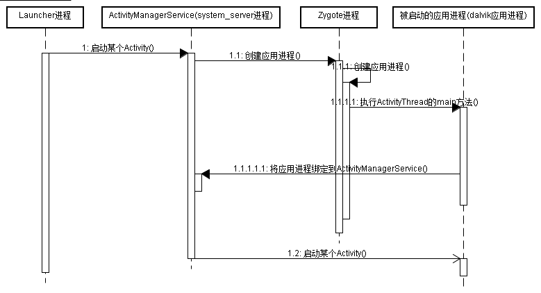

> 原文链接：[Cloud Chou](http://weibo.com/muguachou). http://www.cloudchou.com/android/post-788.html

## 概述

Android中启动某个Activity，将先启动Activity所在的应用。应用启动时会启动一个以应用包名为进程名的进程，该进程有一个主线程，叫ActivityThread，也叫做UI线程。

本系列博客将详细阐述Activity的启动流程，这些博客基于Cm 10.1源码研究。

- [深入理解Activity启动流程(二)--Activity启动相关类的类图](http://www.cloudchou.com/android/post-793.html)
- [深入理解Activity启动流程(三)--Activity启动的详细流程1](http://www.cloudchou.com/android/post-805.html)
- [深入理解Activity启动流程(三)--Activity启动的详细流程2](http://www.cloudchou.com/android/post-815.html)
- [深入理解Activity启动流程(四)--Activity Task的调度算法](http://www.cloudchou.com/android/post-858.html)

## Activity启动时的概要交互流程

用户从Launcher程序点击应用图标可启动应用的入口Activity，Activity启动时需要多个进程之间的交互，Android系统中有一个zygote进程专用于孵化Android框架层和应用层程序的进程。还有一个system_server进程，该进程里运行了很多binder service，例如ActivityManagerService，PackageManagerService，WindowManagerService，这些binder service分别运行在不同的线程中，其中ActivityManagerService负责管理Activity栈，应用进程，task。

Activity启动时的概要交互流程如下图如下所示(点击图片可看[大图](http://www.cloudchou.com/wp-content/uploads/2015/05/activity_start_flow.png)):

用户在Launcher程序里点击应用图标时，会通知ActivityManagerService启动应用的入口Activity，ActivityManagerService发现这个应用还未启动，则会通知Zygote进程孵化出应用进程，然后在这个dalvik应用进程里执行ActivityThread的main方法。应用进程接下来通知ActivityManagerService应用进程已启动，ActivityManagerService保存应用进程的一个代理对象，这样ActivityManagerService可以通过这个代理对象控制应用进程，然后ActivityManagerService通知应用进程创建入口Activity的实例，并执行它的生命周期方法。