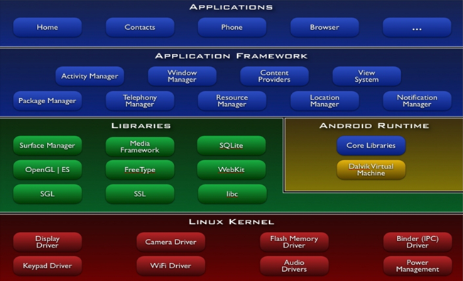

> 原文链接：http://blog.csdn.net/lmj623565791/article/details/24015867/

下面的题目都是楼主在[Android](http://lib.csdn.net/base/android)交流群大家面试时遇到的，如果大家有好的题目或者好的见解欢迎分享，楼主将长期维护此帖。

## 某公司高级面试题

1、详述Android系统架构，包括层与层之间调用、binder、jni、底层文件读写方法

android源码之前分为四层，如下图：



新的android源码分为五层（[平台架构](平台架构.md)），增加了HAL层，如下图：


- Linux Kernel

Linux内核，主要是一些硬件驱动和Binder驱动（IPC进程间通信）

- 硬件抽象层

Android系统的硬件抽象层（Hardware Abstract Layer，HAL）运行用户空间中，它向下屏蔽硬件驱动模块的实现细节，向上提供硬件访问服务。通过硬件抽象层，Android系统分两层来支持硬件设备，其中一层实现在用户空间中，另一层实现在内核空间中。传统的Linux系统把对硬件的支持完全实现在内核空间中，即把对硬件的支持完全实现在硬件驱动模块中。

Android系统里封装内核驱动程序的接口层。对上层提供接口，屏蔽底层驱动实现细节.

本来Linux内核可以负责驱动接口定义和驱动实现，但是受限于GNU License（开源感染性），如果厂商选择驱动接口和实现都在内核空间完成，就必须开放自己的驱动源代码。这是不符合厂商利益的（驱动包含核心硬件参数，与其他厂家竞争的法宝）。所以Google将Linux内核中跟底层硬件操作相关的逻辑封装成HAL层接口，厂商基于接口去实现，不直接在内核空间实现驱动。因为Android系统遵循Apache License，不强制开源。

- Libraries and Android Runtime

原生C/C++库，系统运行的核心库，Android运行时环境，包括核心库和dvm

- Application FrameWork 框架层

提供的是Java API，主要是各种Manager，如WindowManager，ActivityManager等。

硬件访问服务通过硬件抽象层模块来为应用程序提供硬件读写操作。由于硬件抽象层模块是使用C++语言开发的，而应用程序框架层中的硬件访问服务是使用Java语言开发的，因此，硬件访问服务必须通过Java本地接口（Java Native Interface，JNI）来调用硬件抽象层模块的接口。

在Android应用程序框架层开发硬件访问服务的目的是为了让上层的Android应用程序能够访问对应的硬件设备。

- Applications 应用层

我们使用的系统自带App或者自己安装的App都属于应用层

应用程序框架中的基于Java语言的Binder接口是通过JNI来调用基于C/C++语言的Binder运行库来为Java应用程序提供进程间通信服务的

2、描述自己的一个项目，要求画出结构图，UML图，详细描述项目种的技术点，技术难点以及解决方案

3、一道[算法](http://lib.csdn.net/base/datastructure)

4、谈谈自己项目管理的方法、对[敏捷，即原型开发](http://lib.csdn.net/base/agile)软件开发的理解

## 基础面试题

**1. 请解释下在单线程模型中Message,Handler,MessageQueue,Looper之间的关系。**

拿主线程来说，主线程启动时会调用Looper.prepare()方法，会初始化一个Looper，放入Threadlocal中，接着调用Looper.loop()不断遍历MessageQueue，Handler的创建依赖与当前线程中的Looper，如果当前线程没有Looper则必须调用Looper.prepare()。Handler , sendMessage到MessageQueue，Looper不断从MessageQueue中取出消息，回调handleMessage方法。 

**2. 如果有个100M大的文件，需要上传至服务器中，而服务器form表单最大只能上传2M，可以用什么方法。**

这个问题不是很明确我觉得，首先来说使用http协议上传数据，特别在android下，跟form没什么关系。传统的在web中，在form中写文件上传，其实浏览器所做的就是将我们的数据进行解析组装拼成字符串，以流的方式发送到服务器，且上传文件用的都是POST方式，POST方式对大小没什么限制。

回到题目，可以说假设每次真的只能上传2M，那么可能我们只能把文件截断，然后分别上传了。

**3. 内存溢出和内存泄漏有什么区别？何时会产生内存泄漏？内存优化有哪些方法？**

内存溢出通俗理解就是软件（应用）运行需要的内存，超出了它可用的最大内存。

内存泄漏就是我们对某一内存空间的使用，使用完成后没有释放。

内存优化：Android中容易内存溢出的部分，就是图片的加载，我们可以使用图片的压缩加上使用LruCache缓存的目的来控制图片所能够使用的内存。

还有对于比较耗资源的对象及时的关闭，例如Database Conn ， 各种传感器 ， Service 等等。

**4. AsyncTask使用在哪些场景？它的缺陷是什么？如何解决？**

AsyncTask 运用的场景就是我们需要进行一些耗时的操作，耗时操作完成后更新主线程，或者在操作过程中对主线程的UI进行更新。

缺陷：AsyncTask中维护着一个长度为128的线程池，同时可以执行5个工作线程，还有一个缓冲队列，当线程池中已有128个线程，缓冲队列已满时，如果此时向线程提交任务，将会抛出RejectedExecutionException。

解决：由一个控制线程来处理AsyncTask的调用判断线程池是否满了，如果满了则线程睡眠否则请求AsyncTask继续处理。

**5. Activity用SharedPreferences保存数据，大小有木有限制？**

这个真心查不到

Sp的底层是由xml实现的，操作Sp的过程就是xml的序列化和解析的过程.Xml是储存在磁盘上的，因此考虑到IO速度问题，sp不适宜频繁操作.同时序列化xml就是将内存中的数据写到xml文件中，由于dvm的内存是很有限的，因此单个sp文件不建议太大，具体多大是没有一个明确的要求的，但是我们知道DVM堆内存也就是16M，因此数据大小肯定不能超过这个数字，其实SP设置的目的就是为了保存用户的偏好和配置信息的，因此建议不要保存太多的数据

**6. Activity间通过Intent传递数据大小有没有限制？**

貌似是40K。Intent貌似应该是1m，Intent携带数据太大是会报错，比如携带一张大图片是就会发生异常

**7. assest文件夹里放文件，对于文件的大小有没有限制？**

assets目录更像一个附录类型的目录，Android不会为这个目录中的文件生成ID并保存在R类当中，因此它与Android中的一些类和方法兼容度更低。

同时，由于你需要一个字符串路径来获取这个目录下的文件描述符，访问的速度会更慢。但是把一些文件放在这个目录下会使一些操作更加方便，比方说拷贝一个[数据库](http://lib.csdn.net/base/mysql)文件到系统内存中。要注意的是，你无法在Android XML文件中引用到assets目录下的文件，只能通过AssetManager来访问

这些文件。数据库文件和游戏数据等放在这个目录下是比较合适的。另外，网上关于assets和raw的资料都千篇一律了，因此关于这两者中单个文件

大小不能超过1M的**错误**描述也在传播，即如果读取超过1M的文件会报"Data exceeds UNCOMPRESS_DATA_MAX (1314625 vs 1048576)"的IOException，还引申出种种解决方案。个人认为不应该有这样的限制，为了验证这个说法写了个Demo，发现将近5M的压缩包在assets和raw中都能正常访问，因此在这里纠正一下，理论上只要打包不超过Android APK 50M大小的限制都是没有问题的。当然了，不排除是Android很早期的时候因为设备硬件原因aapt在编译的时候对这两个文件夹大小做出了限制，如果是这样，较新版的ADT应该不会出现这种情况。

来自：http://my.eoe.cn/futurexiong/archive/5350.html

**8. 启动一个程序，可以主界面点击图标进入，也可以从一个程序中跳转过去，二者有什么区别？**

是因为启动程序（主界面也是一个app），发现了在这个程序中存在一个设置为`<category android:name="android.intent.category.LAUNCHER" />`的activity,所以这个launcher会把icon提出来，放在主界面上。当用户点击icon的时候，发出一个Intent：

```java
Intent intent = mActivity.getPackageManager().getLaunchIntentForPackage(packageName);
mActivity.startActivity(intent);
```

跳过去可以跳到任意允许的页面，如一个程序可以下载，那么真正下载的页面可能不是首页（也有可能是首页），这时还是构造一个Intent，startActivity.这个intent中的action可能有多种view,download都有可能。系统会根据第三方程序向系统注册的功能，为你的Intent选择可以打开的程序或者页面。所以唯一的一点不同的是从icon的点击启动的intent的action是相对单一的，从程序中跳转或者启动可能样式更多一些。本质是相同的。

**9. 程序之间的亲和性的理解**

- 默认情况下一个应用的所有Activity都是具有相同的affinity，都是从application中继承，application的affinity默认就是manifest的包名。
- affinity对Activity来说，就像是身份证一样，可以告诉所在的Task，自己属于其中的一员。
- 应用场合：
  - 根据affinity重新为Activity选择合适的宿主Task
  - 与allowTaskReparenting属性配合
  - 启动Activity使用Intent设置了FLAG_ACTIVITY_NEW_TASK标记

**10. 同一个程序，但不同的Activity是否可以放在不同的Task任务栈中？**

可以放在不同的Task中。需要为不同的activity设置不同的affinity属性，启动activity的Intent需要包含FLAG_ACTIVITY_NEW_TASK标记。

**11. 横竖屏切换时候Activity的生命周期。**

- 不设置Activity的android:configChanges时，切屏会重新调用各个生命周期，切横屏时会执行一次，切竖屏时会执行两次
- 设置Activity的android:configChanges="orientation"时，切屏还是会重新调用各个生命周期，切横、竖屏时只会执行一次
- 设置Activity的android:configChanges="orientation|keyboardHidden"时，切屏不会重新调用各个生命周期，只会执行onConfigurationChanged方法

**12. AIDL的全称是什么？如何工作？**

全称是：Android Interface Define Language

在Android中, 每个应用程序都可以有自己的进程. 在写UI应用的时候, 经常要用到Service. 在不同的进程中, 怎样传递对象呢? 显然, [Java](http://lib.csdn.net/base/javase)中不允许跨进程内存共享.

 因此传递对象, 只能把对象拆分成[操作系统](http://lib.csdn.net/base/operatingsystem)能理解的简单形式, 以达到跨界对象访问的目的. 在J2EE中,采用RMI的方式, 可以通过序列化传递对象. 在Android中, 则采用AIDL的方式. 理论上AIDL可以传递Bundle,实际上做起来却比较麻烦。

AIDL(Android接口描述语言)是一种接口描述语言; 编译器可以通过aidl文件生成一段代码，通过预先定义的接口达到两个进程内部通信进程的目的. 如果需要在一个Activity中, 访问另一个Service中的某个对象, 需要先将对象转化成AIDL可识别的参数(可能是多个参数), 然后使用AIDL来传递这些参数, 在消息的接收端, 使用这些参数组装成自己需要的对象.AIDL的IPC的机制和COM或CORBA类似, 是基于接口的，但它是轻量级的。它使用代理类在客户端和实现层间传递值. 如果要使用AIDL, 需要完成2件事情: 1. 引入AIDL的相关类; 2. 调用aidl产生的class.

AIDL的创建方法:

AIDL语法很简单,可以用来声明一个带一个或多个方法的接口，也可以传递参数和返回值。 由于远程调用的需要, 这些参数和返回值并不是任何类型.

下面是些AIDL支持的数据类型:

1. 不需要import声明的简单Java编程语言类型(int,boolean等)


2. String, CharSequence不需要特殊声明


3. List, Map和Parcelables类型, 这些类型内所包含的数据成员也只能是简单数据类型, String等其他比支持的类型.

(另外: 我没尝试Parcelables, 在Eclipse+ADT下编译不过, 或许以后会有所支持

**13. dvm的进程和Linux的进程, 应用程序的进程是否为同一个概念**

Dvm的进程是dalivk虚拟机进程,每个android程序都运行在自己的进程里面,每个android程序系统都会给他分配一个单独的liunx uid(user id),每个dvm都是linux里面的一个进程.所以说这两个进程是一个进程.