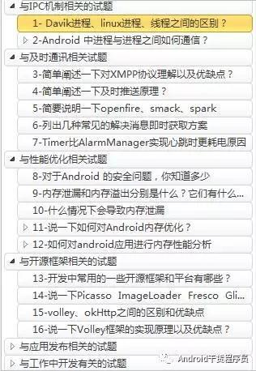
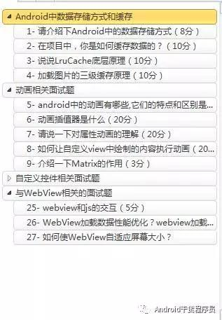
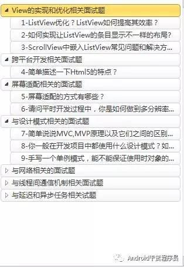
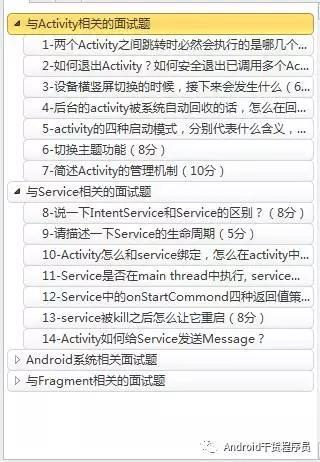

### 整个面试题视频如下(持续更新中)：

#### 与IPC机制相关面试题

- [1- Davik进程linux进程线程之间的区别](https://v.qq.com/x/page/a03916l1n7h.html)
- [2- aidl实现进程间通信](https://v.qq.com/x/page/m0391pnoyl7.html)
- [3- messenger实现进程间通信](https://v.qq.com/x/page/t0391b2gjm5.html)
- [4- ContentProvider实现进程间通信](https://v.qq.com/x/page/v0391vx3ynb.html)

#### 与性能优化相关试题

- [5- 什么是内存泄漏](https://v.qq.com/x/page/n0391if5dtb.html)
- [6- 什么是内存溢出](https://v.qq.com/x/page/q03917e4zk5.html)
- [7- 什么情况会导致内存泄漏](https://v.qq.com/x/page/j03927ullcj.html)
- [8- 避免程序的OOM异常](https://v.qq.com/x/page/w0392bn6wto.html)
- [9- 线程池原理](https://v.qq.com/x/page/u0393izwfut.html)
- [10- UI性能优化](https://v.qq.com/x/page/j0393ytx9ob.html)
- [11- 内存优化之字符串优化](https://v.qq.com/x/page/k0393ataw3l.html)
- [12- 常见内存优化方式](https://v.qq.com/x/page/j0393gm2p7j.html)
- [13- 性能分析之hierarchyviewer使用](https://v.qq.com/x/page/y0393sa0jlp.html)
- [14- 性能分析之Lint规范代码](https://v.qq.com/x/page/d039381wbas.html)
- [15- 性能分析之规避内存抖动](https://v.qq.com/x/page/x0393gf7qp6.html)
- [16- 性能分析之内存检测工具介绍](https://v.qq.com/x/page/e03933o0tp7.html)

#### 与XMPP相关试题

- [17- 什么是XMPP和XMPP的数据格式](https://v.qq.com/x/page/t0394w3zhoa.html)
- [18- 及时聊天的展示形式](https://v.qq.com/x/page/k0394y5jo6d.html)
- [19- TCP和UDP协议](https://v.qq.com/x/page/b0394lzj76e.html)
- [20- 极光推送原理](https://v.qq.com/x/page/h0394a7zioh.html)
- [21- XMPP的基本概念](https://v.qq.com/x/page/s0394k4p10i.html)
- [22- 常见消息推送的解决方案](https://v.qq.com/x/page/h0394s3mc5k.html)

#### 与登录相关试题

- [23- 微信扫一扫登录内部实现原理](https://v.qq.com/x/page/u03952rbbkc.html)
- [24- 腾讯QQ三方登录实现原理](https://v.qq.com/x/page/p03953hoam3.html)
- [25- 登录为什么要使用Token](https://v.qq.com/x/page/c0395s3jd4f.html)

#### 与开发相关试题

- [26- 迭代开发的时候如何向前兼容新旧接口](https://v.qq.com/x/page/a0395pv28zm.html)
- [27- 应用程序的开发流程](https://v.qq.com/x/page/v0395agrpdw.html)