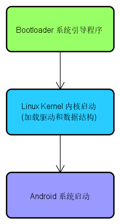
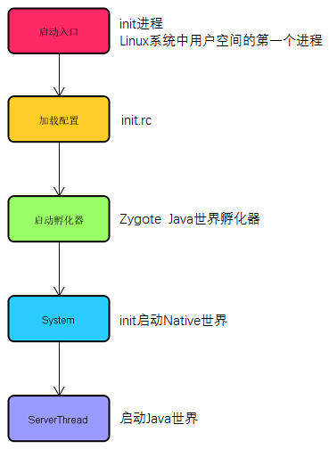
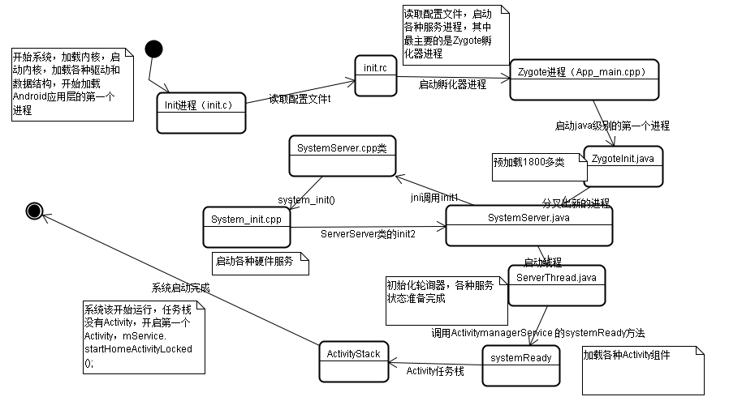

## Android启动流程

   



在Android系统启动时，第一个启动起来的进程就是Zygote（进程孵化器）进程，然后由Zygote启动SystemServer，再后就是启动ActivityManagerService，WindowManagerService等系统核心服务，这些服务承载着整个Android系统与客户端程序交互的重担。Zygote除了启动系统服务和进程之外，普通的用户进程也由Zygote进程fork而来，当一个应用进程启动起来后，就会加载用户在清单文件（AndroidManifest.xml）中配置的默认加载的Activity，此时加载的入口是`ActivityThread.main(String[] args)`，这个方法就类似与C语言中的main()方法，是整个应用程序的入口。

由操作系统的引导文件去运行linux的内核程序，内核程序开始启动的时候会加载各种驱动和数据结构，开始加载android应用层的第一个进程（init进程c代码（system\core\init目录） Init.c）

Zygote进程 --> SystemServer --> 系统服务AMS，WMS，PMS...

1、当引导程序启动Linux内核后，会加载各种驱动和数据结构，当有了驱动以后，开始启动Android系统同时会加载用户级别的第一个进程init（system\core\init.c）代码如下：
```c
int main(int argc, char **argv)
{
    // 创建文件夹 挂载
    mount("tmpfs", "/dev", "tmpfs", 0, "mode=0755");
    mkdir("/dev/pts", 0755);
   
    // 打卡日志
    log_init();
    
    INFO("reading config file\n");
    // 加载init.rc配置文件
    init_parse_config_file("/init.rc");
} 
```

2、加载init.rc文件，会启动一个Zygote进程，此进程是Android系统的一个母进程，用来启动Android的其他服务进程，代码：
```
service zygote /system/bin/app_process -Xzygote /system/bin --zygote --start-system-server
socket zygote stream 666
onrestart write /sys/android_power/request_state wake
onrestart write /sys/power/state on
onrestart restart media
onrestart restart netd
```
3、从c++代码调到java代码：
```c++
int main(int argc, const char* const argv[])
{
    ...
    // Android运行时环境
    AppRuntime runtime;
    ...
    // Next arg is startup classname or "--zygote"
    if (i < argc) {
        arg = argv[i++];
        if (0 == strcmp("--zygote", arg)) {
            bool startSystemServer = (i < argc) ? 
                    strcmp(argv[i], "--start-system-server") == 0 : false;
            setArgv0(argv0, "zygote");
            set_process_name("zygote");
            // 启动java代码
            runtime.start("com.android.internal.os.ZygoteInit",
         ...
}
```
4、ZygoteInit.java 代码：
```java
 public static void main(String argv[]) {
        try {
            VMRuntime.getRuntime().setMinimumHeapSize(5 * 1024 * 1024);
    
    		// 加载Android依赖的类
            preloadClasses();
            //cacheRegisterMaps();
            preloadResources();
            ...
    
            if (argv[1].equals("true")) {
    			// 启动系统服务
                startSystemServer();
            } else if (!argv[1].equals("false")) {
           ...
    }

	private static boolean startSystemServer()
	     ...
	        args = new String[] {
	            "--setuid=1000",
	            "--setgid=1000",
	            "--setgroups=1001,1002,1003,1004,1005,1006,1007,1008,1009,1010,1018,3001,3002,3003,3006",
	            "--capabilities=130104352,130104352",
	            "--rlimit=8,",
	            "--runtime-init",
	            "--nice-name=system_server",
	            "com.android.server.SystemServer",
	      ...
	
	        /* Request to fork the system server process */
			// 母进程开始分叉服务 启动SystemServer
	        pid = Zygote.forkSystemServer(
	                parsedArgs.uid, parsedArgs.gid,
	                parsedArgs.gids, debugFlags, rlimits,
	                parsedArgs.permittedCapabilities,
	                parsedArgs.effectiveCapabilities);
	    ..
	}
```
5、SystemServer.java 代码
```java
 public static void main(String[] args) {
    ... 
    // 加载jni库
    System.loadLibrary("android_servers");
    // 调用native方法
    init1(args);
}
native public static void init1(String[] args);
```
6、SystemServer 对应的c++代码 com_android_server_SystemServer.cpp 代码如下：
```
	// 类似java的抽象方法
	extern "C" int system_init();
	
	static void android_server_SystemServer_init1(JNIEnv* env, jobject clazz)
	{	
		// 转调
	    system_init();
	}
	
	/*
	 * JNI registration.
	 */
	static JNINativeMethod gMethods[] = {
	    /* name, signature, funcPtr */ 
		// 函数指针 把init1方法映射到android_server_SystemServer_init1
	    { "init1", "([Ljava/lang/String;)V", (void*) android_server_SystemServer_init1 },
	};
```
7、system_init 的实现方法在System_init.cpp 代码如下：
```
	extern "C" status_t system_init()
	{
	    ...
		// 启动硬件的服务
	    if (strcmp(propBuf, "1") == 0) {
	        // Start the SurfaceFlinger
	        SurfaceFlinger::instantiate();
	    }

	    AndroidRuntime* runtime = AndroidRuntime::getRuntime();

	    LOGI("System server: starting Android services.\n");
		// 启动完硬件服务后，又回到Systemserver的init2方法
	    runtime->callStatic("com/android/server/SystemServer", "init2");
	    ...
	}
```
8、SystemServer 的init2方法代码：
```java
public static final void init2() {
        Slog.i(TAG, "Entered the Android system server!");
        Thread thr = new ServerThread();
        thr.setName("android.server.ServerThread");
        thr.start();
}
```
9、ServerThread的run方法：
```
public void run() {
        ...
    	// 开启Android各种服务并且添加到ServiceManager去管理
        Slog.i(TAG, "Device Policy");
        devicePolicy = new DevicePolicyManagerService(context);
        ServiceManager.addService(Context.DEVICE_POLICY_SERVICE, ottle = 
    
        ...
        // We now tell the activity manager it is okay to run third party
        // code.  It will call back into us once it has gotten to the state
        // where third party code can really run (but before it has actually
        // started launching the initial applications), for us to complete our
        // initialization.
    	// 各种服务开启后调用ActivityManagerService.systemReady
        ((ActivityManagerService)ActivityManagerNative.getDefault())
                .systemReady(new Runnable() {
            public void run() {
                Slog.i(TAG, "Making services ready");
```
10、ActivityMangerService的systemReady的方法：
```
	public void systemReady(final Runnable goingCallback) {
	        ...
			// 打开第一个Activity
	            mMainStack.resumeTopActivityLocked(null);
	        }
	    }
```
11、ActivityStack的resumeTopActivityLocked方法
```
	final boolean resumeTopActivityLocked(ActivityRecord prev) {
	        // Find the first activity that is not finishing.
			// 没有已经打开的Activity next为 null
	        ActivityRecord next = topRunningActivityLocked(null);
	
	        // Remember how we'll process this pause/resume situation, and ensure
	        // that the state is reset however we wind up proceeding.
	        final boolean userLeaving = mUserLeaving;
	        mUserLeaving = false;
	
	        if (next == null) {
	            // There are no more activities!  Let's just start up the
	            // Launcher...
	
	            if (mMainStack) {
					// 启动lucher应用的锁屏界面
	                return mService.startHomeActivityLocked();
	            }
	        }
```
12、Android系统启动完成，打开了Luncher应用的Home界面。

## 面试记录

1.对比ListView跟RecyclerView，RecyclerView有什么优势？

2.了解过哪些网络框架？OkHttp比HttpURLConntaion好在哪里？

3.Retrofit怎么进行二次封装？有哪些好处？

4.自定义View的了解？

5.短信验证码怎么保证登录的安全？

- 密码加密

  md5，非对称加密

- 动态密码

- 验证码

- 有效时间

- TrustZone

https://www.zhihu.com/question/24173904

身份认证有三个方式：你知道的，你持有的，以及你固有的。一般的口令密码之类算第一类（你知道的），持有令牌通行证之类算第二类（你持有的），指纹虹膜等生物特征算第三类（你固有的）。由于获取／伪造的难度不同，一般认为第一类的安全性比第二类差，第二类又比第三类差；但需要明确的是，如果只有其中一种都算是弱认证，必须独立使用两种甚至三种才算是强认证。

普通应用比如邮箱的认证方式都是口令或密码这第一类认证，使用短信验证码则是为了提供第二类认证。在安全设定中，做得好的系统会要求关键修改要同时使用两种认证方式，即：使用密码登录，然后修改关键信息比如已经注册过的手机号，还需要先用之前的手机接收验证码；单独获得手机后，是不应该能够登入账户并修改所有信息的，否则就破坏了多种认证方式直接的独立性，进而破坏了系统的安全性。

在智能手机的年代，由于OS开放了短信操作和拦截的接口（Android直接提供，iOS需要越狱），对于一个安装了支付类App的智能手机且绑定账户的SIM卡也安装在同一个手机的情况（绝大部分情况下是这样），短信验证事实上已经退化成了单因子验证，只要智能手机被安装了木马那么这些验证体系就会全线崩溃，攻击者甚至可以只通过钓鱼wifi全部搞定登陆密码、支付密码和短信验证

[短信验证码](http://www.jinloushiji.cn/)算是短信细分行业里的小众行业，因为价格便宜却能针对性的起到大力宣传作用，自然短信这个行业的竞争也愈演愈烈，各个短信运营商都绞尽脑汁在确保网站短信验证码接口相关措施的严密。

阅信短信验证码平台小编下面从五个方面入手说说阅信短信平台是怎么做的：

- 绑定服务器IP。供应商的短信验证码接口只能识别客户的绑定服务器IP，否则将会报错；
- 开启反投诉策略。短信验证码接口容易受到轰炸，供应商应将同个手机号码在24小时内接收同一根通道短信条数最大值设置为10；

阅信网站短信验证码接口

- 防盗用策略。为了防止客户账号被盗，供应商可以限制短信验证码接口任何时间段的任意条数上限。类似于刚刚上线的App客户，短信日发送上限可以设置成10000条；
- 关闭网页发送短信权限。验证码基本上经由短信验证码接口提交，所以web端的网页提交功能应该关闭；
- 绑定后台登录手机号码。短信接口管理后台可以查看到每一条短信的发送详情，为了保证数据安全，必须要指定专人管理，登录后台要收到手机短信验证码才能登录成功。

当然，验证码安全并不完全由通道供应商单方面控制，从平台开发者本身出发，也需要做好防范机制，例如完善网站入口处的二次验证。

随着App项目的推广，网站或手机短信验证码接口广泛应用在用户验证各方面，大大降低了非法注册，烂注册的数据的出现，所以其安全防范机制尤为重要。

6.线程间通信有哪些方式？


gravity跟layout_gravity区别

静态成员变量运行题

常见五种布局

自动更新原理

Activity生命周期

手写数据表查询年龄最大的十个人

数据存储的几种方式

通过网络请求加载图片并缓存到本地

第二次加载图片时从本地加载


用实际例子问我权重，sp，数据库，然后看了下app，问了哪些新控件使用比较熟，然后问RecyclerView怎么添加分隔线，我说用网上找的工具类。数据库很重视，但是问的几个问题我都只能说出思路。

Android已离职，面试我的估计是java，上来先问了个反射，然后对着简历挑着跟java沾边的东西问，比如线程间通信，MVP跟MVC模式，Cookie，然后问了些安卓的自定义View的绘制流程、事件分发机制、第三方SDK。一开始还问了我做没做过百度地图，我说做过但是没有扩展很多功能，只做了基本的功能实现，然后他问导航做过没，我说没有。实际上他们公司下个项目就要用到百度地图。

公司环境一般，一个大厅用玻璃隔出了一个会议室跟老板办公室，剩下的就是两排桌子面对面坐着8~10个人，员工都比较年轻，很多刚毕业的。面试我的人感觉经验也不丰富，技术水平应该比较一般

1.AIDL简历写了的，抓紧了解清楚怎么使用！
2.对称加密与非对称加密的区别，进程间通信的所有方式，数据库优化与框架（存入一万条数据怎么优化？），事件分发细节不够清楚(返回true/false/super相应有什么结果？)，内容提供者不熟悉，网络框架源码必须得看一个！

上来狂怼Java基础和Java相关的知识点，问了怎么创建线程？暂停线程的两种方法及区别？AIDL服务怎么暴露方法？工厂模式？观察者模式？http长连接短连接和组成？使用什么请求？数据库？线程池的使用场景？

面试上来先自我介绍，完了就开始聊项目，感觉整个过程都挺随意的，问了挺多问题，但是基本都没有深究，基本没问到太细节的实现。JNI跟混合开发都有被问到，看来还是得了解一点其他知识点给自己涨涨身价

面试官起码三十多岁，问的网络的问题听着都很懵逼，还问到app测试版跟正式版有什么不同？三个gradle有什么区别？对gradle有什么理解？有没有发生过闪退？怎么定位问题？

问了些实际开发的问题，比如pad上图标如何适配，UI给比例图时我们怎么确定文字的大小，集成第三方SDK需要多少时间。

问的比较简单，就自定义View跟事件分发、Activity、服务、网络、进程通信，还简单讲了一下Binder的底层原理。顺利通过技术面试

跟老板谈了下，被问到认为自己技术还有哪些方面需要提升，顺势说目前已经了解过Binder底层，还需要了解更多Android底层的东西和框架的实现原理，以便更好运用和修改。问到职业规划表示自己不光对技术感兴趣，对产品也很感兴趣。然后讲了下对上个公司产品的一些看法，对他们公司产品的看法，提了两个优化的点。基本就顺利过关了