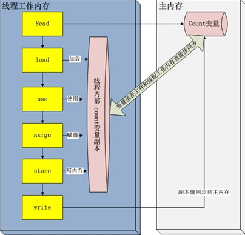

有人可能会问对于我们学Android的同学来讲，面试还会问Java基础吗？答案是会的，但是不会太多，因此我给了两颗星的重要程度。一般笔试的时候出现java基础题的概率比较大，口头面试的时候比较少，比如自己在面试的时候一些对基础知识比较看重的面试官会深究着Java基础去问，比如问你异常的类型以及处理方式，集合的体系结构等等。

# 1. Java面向对象思想

## 面向对象都有哪些特性以及你对这些特性的理解


继承：继承是从已有类得到继承信息创建新类的过程。提供继承信息的类被称为父类（超类、基类）；得到继承信息的类被称为子类（派生类）。继承让变化中的软件系统有了一定的延续性，同时继承也是封装程序中可变因素的重要手段。

封装：通常认为封装是把数据和操作数据的方法绑定起来，对数据的访问只能通过已定义的接口。面向对象的本质就是将现实世界描绘成一系列完全自治、封闭的对象。我们在类中编写的方法就是对实现细节的一种封装；我们编写一个类就是对数据和数据操作的封装。可以说，封装就是隐藏一切可隐藏的东西，只向外界提供最简单的编程接口。

多态：多态性是指允许不同子类型的对象对同一消息作出不同的响应。简单的说就是用同样的对象引用调用同样的方法但是做了不同的事情。多态性分为编译时的多态性和运行时的多态性。如果将对象的方法视为对象向外界提供的服务，那么运行时的多态性可以解释为：当A系统访问B系统提供的服务时，B系统有多种提供服务的方式，但一切对A系统来说都是透明的。方法重载（overload）实现的是编译时的多态性（也称为前绑定），而方法重写（override）实现的是运行时的多态性（也称为后绑定）。运行时的多态是面向对象最精髓的东西，要实现多态需要做两件事：

- 方法重写（子类继承父类并重写父类中已有的或抽象的方法）
- 对象造型（用父类型引用引用子类型对象，这样同样的引用调用同样的方法就会根据子类对象的不同而表现出不同的行为）

抽象：抽象是将一类对象的共同特征总结出来构造类的过程，包括数据抽象和行为抽象两方面。抽象只关注对象有哪些属性和行为，并不关注这些行为的细节是什么。

# 2. Java中的多态

## Java中实现多态的机制是什么？

靠的是父类或接口定义的引用变量可以指向子类或具体实现类的实例对象，而程序调用的方法在运行期才动态绑定，就是引用变量所指向的具体实例对象的方法，也就是内存里正在运行的那个对象的方法，而不是引用变量的类型中定义的方法。

# 3. Java的异常处理

## 3.1 Java中异常分为哪些种类

按照异常需要处理的时机分为编译时异常也叫CheckedException和运行时异常也叫RuntimeException。只有java语言提供了Checked异常，Java认为Checked异常都是可以被处理的异常，所以Java程序必须显式处理Checked异常。如果程序没有处理Checked异常，该程序在编译时就会发生错误无法编译。这体现了Java的设计哲学：没有完善错误处理的代码根本没有机会被执行。对Checked异常处理方法有两种：

- 当前方法知道如何处理该异常，则用try...catch块来处理该异常。

- 当前方法不知道如何处理，则在定义该方法是声明抛出该异常。

运行时异常只有当代码在运行时才发行的异常，编译时不需要try、catch。Runtime如除数是0和数组下标越界等，其产生频繁，处理麻烦，若显示申明或者捕获将会对程序的可读性和运行效率影响很大。所以由系统自动检测并将它们交给缺省的异常处理程序。当然如果你有处理要求也可以显示捕获它们。

## 3.2 调用下面的方法，得到的返回值是什么

```java
public int getNum(){
     try {
        int a = 1/0;
        return 1;
    } catch (Exception e) {
        return 2;
    } finally{
        return 3;
    }
}
```
代码在走到第3行的时候遇到了一个MathException，这时第四行的代码就不会执行了，代码直接跳转到catch语句中，走到第6行的时候，异常机制有这么一个原则如果在catch中遇到了return或者异常等能使该函数终止的话那么用finally就必须先执行完finally代码块里面的代码然后再返回值。因此代码又跳到第8行，可惜第8行是一个return语句，那么这个时候方法就结束了，因此第6行的返回结果就无法被真正返回。如果finally仅仅是处理了一个释放资源的操作，那么该道题最终返回的结果就是2。

因此上面返回值是3。

# 4. Java的数据类型

## 4.1 Java的基本数据类型都有哪些各占几个字节？     

Java有8种基本数据类型

| 数据类型    | 字节数  |
| :------ | :--- |
| byte    | 1    |
| char    | 2    |
| short   | 2    |
| int     | 4    |
| float   | 4    |
| double  | 8    |
| long    | 8    |
| boolean | 1    |

PS：boolean类型比较特别可能只占一个bit，多个boolean可能共同占用一个字节

## 4.2 String是基本数据类型吗？可以被继承吗？

String是引用类型，底层用char数组实现的。因为String是final类，在java中被final修饰的类不能被继承，因此String当然不可以被继承。

# 5. Java的IO

# 5.1 Java中有几种类型的流

字节流和字符流。字节流继承于InputStream和OutputStream，字符流继承于InputStreamReader 和OutputStreamWriter。

## 5.2 字节流如何转为字符流

字节输入流转字符输入流通过InputStreamReader实现，该类的构造函数可以传入InputStream对象。

字节输出流转字符输出流通过OutputStreamWriter实现，该类的构造函数可以传入OutputStream对象。

## 5.3 如何将一个java对象序列化到文件里？

在java中能够被序列化的类必须先实现Serializable接口，该接口没有任何抽象方法只是起到一个标记作用。

```java
//对象输出流
ObjectOutputStream objectOutputStream = new ObjectOutputStream(new FileOutputStream(new File("D://obj")));
objectOutputStream.writeObject(new User("zhangsan", 100));
objectOutputStream.close();
//对象输入流
ObjectInputStream objectInputStream = new ObjectInputStream(new FileInputStream(new File("D://obj")));
User user = (User)objectInputStream.readObject();
System.out.println(user);
objectInputStream.close();
```

# 6. Java的集合

## 6.1 HashMap排序题，上机题。(本人主要靠这道题入职的第一家公司)

已知一个HashMap\<Integer，User>集合， User有name（String）和age（int）属性。请写一个方法实现对HashMap的排序功能，该方法接收HashMap\<Integer，User>为形参，返回类型为HashMap\<Integer，User>，要求对HashMap中的User的age倒序进行排序。排序时key=value键值对不得拆散。

要做出这道题必须对集合的体系结构非常的熟悉。HashMap本身就是不可排序的，但是该道题偏偏让给HashMap排序，那我们就得想在API中有没有这样的Map结构是有序的，LinkedHashMap，对的，就是他，他是Map结构，也是链表结构，有序的，更可喜的是他是HashMap的子类，我们返回LinkedHashMap\<Integer,User>即可，还符合面向接口（父类编程的思想）。但凡是对集合的操作，我们应该保持一个原则就是能用JDK中的API就有JDK中的API，比如排序算法我们不应该去用冒泡或者选择，而是首先想到用Collections集合工具类。

```java
public class HashMapTest {
        public static void main(String[] args) {
                HashMap<Integer, User> users = new HashMap<>();
                users.put(1, new User("张三", 25));
                users.put(3, new User("李四", 22));
                users.put(2, new User("王五", 28));
                System.out.println(users);
                HashMap<Integer,User> sortHashMap = sortHashMap(users);
                System.out.println(sortHashMap);
                 /
                  * 控制台输出内容
                  * {1=User [name=张三, age=25], 2=User [name=王五, age=28], 3=User [name=李四, age=22]}
                  *  {2=User [name=王五, age=28], 1=User [name=张三, age=25], 3=User [name=李四, age=22]}
                  */
         }

         public static HashMap<Integer, User> sortHashMap(HashMap<Integer, User> map) {
                 // 首先拿到map的键值对集合
                 Set<Entry<Integer, User>> entrySet = map.entrySet();

                 // 将set集合转为List集合，为什么，为了使用工具类的排序方法
                 List<Entry<Integer, User>> list = new ArrayList<Entry<Integer, User>>(entrySet);
                 // 使用Collections集合工具类对list进行排序，排序规则使用匿名内部类来实现
                 Collections.sort(list, new Comparator<Entry<Integer, User>>() {
                         @Override
                         public int compare(Entry<Integer, User> o1, Entry<Integer, User> o2) {
                                 //按照要求根据User的age的倒序进行排
                                 return o2.getValue().getAge()-o1.getValue().getAge();
                         }
                 });
                 //创建一个新的有序的HashMap子类的集合
                 LinkedHashMap<Integer, User> linkedHashMap = new LinkedHashMap<Integer, User>();
                 //将List中的数据存储在LinkedHashMap中
                 for(Entry<Integer, User> entry : list){
                         linkedHashMap.put(entry.getKey(), entry.getValue());
                 }
                 //返回结果
                 return linkedHashMap;
         }
 }
```

## 6.2 集合的安全性问题

请问ArrayList、HashSet、HashMap是线程安全的吗？如果不是我想要线程安全的集合怎么办？

我们都看过上面那些集合的源码（如果没有那就看看吧），每个方法都没有加锁，显然都是线程不安全的。话又说过来如果他们安全了也就没第二问了。

在集合中Vector和HashTable倒是线程安全的。你打开源码会发现其实就是把各自核心方法添加上了synchronized关键字。Collections工具类提供了相关的API，可以让上面那3个不安全的集合变为安全的。

```java
Collections.synchronizedCollection(c);
Collections.synchronizedList(list);
Collections.synchronizedMap(m);
Collections.synchronizedSet(s);
```

上面几个函数都有对应的返回值类型，传入什么类型返回什么类型。打开源码其实实现原理非常简单，就是将集合的核心方法添加上了synchronized关键字。

# 7. Java的多线程

## 7.1 多线程的两种创建方式

java.lang.Thread 类的实例就是一个线程但是它需要调用java.lang.Runnable接口来执行，由于线程类本身就是调用的Runnable接口所以你可以继承java.lang.Thread 类或者直接实现Runnable接口来重写run()方法实现线程。

## 7.2 在java中wait和sleep方法的不同？


最大的不同是在等待时wait会释放锁，而sleep一直持有锁。wait通常被用于线程间交互，sleep通常被用于暂停执行。

## 7.3 synchronized和volatile关键字的作用

一旦一个共享变量（类的成员变量、类的静态成员变量）被volatile修饰之后，那么就具备了两层语义：

- 保证了不同线程对这个变量进行操作时的可见性，即一个线程修改了某个变量的值，这新值对其他线程来说是立即可见的。

- 禁止进行指令重排序。

volatile本质是在告诉jvm当前变量在寄存器（工作内存）中的值是不确定的，需要从主存中读取；

synchronized则是锁定当前变量，只有当前线程可以访问该变量，其他线程被阻塞住。

- volatile仅能使用在变量级别；synchronized则可以使用在变量、方法、和类级别的
- volatile仅能实现变量的修改可见性，并不能保证原子性；synchronized则可以保证变量的修改可见性和原子性
- volatile不会造成线程的阻塞；synchronized可能会造成线程的阻塞。
- volatile标记的变量不会被编译器优化；synchronized标记的变量可以被编译器优化

## 7.4 分析代码解释原因

```java
public class Counter {
        private volatile int count = 0;
        public void inc(){
                try {
                        Thread.sleep(3);
                } catch (InterruptedException e) {
                        e.printStackTrace();
                }
                count++;
        }
        @Override
        public String toString() {
                return "[count=" + count + "]";
        }
}        
public class VolatileTest {
        public static void main(String[] args) {
                final Counter counter = new Counter();
                for(int i=0;i<1000;i++){
                        new Thread(new Runnable() {
                                @Override
                                public void run() {
                                        counter.inc();
                                }
                        }).start();
                }
                System.out.println(counter);
        }
}
```
上面的代码执行完后输出的结果确定为1000吗？   

答案是不一定，或者不等于1000。这是为什么吗？       

在 java 的内存模型中每一个线程运行时都有一个线程栈，线程栈保存了线程运行时候变量值信息。当线程访问某一个对象时候值的时候，首先通过对象的引用找到对应在堆内存的变量的值，然后把堆内存变量的具体值load到线程本地内存中，建立一个变量副本，之后线程就不再和对象在堆内存变量值有任何关系，而是直接修改副本变量的值，在修改完之后的某一个时刻（线程退出之前），自动把线程变量副本的值回写到对象在堆中变量。这样在堆中的对象的值就产生变化了。也就是说上面主函数中开启了1000个子线程，每个线程都有一个变量副本，每个线程修改变量只是临时修改了自己的副本，当线程结束时再将修改的值写入在主内存中，这样就出现了线程安全问题。因此结果就不可能等于1000了，一般都会小于1000。

上面的解释用一张图表示如下：



## 7.5 什么是线程池，如何使用？

线程池就是事先将多个线程对象放到一个容器中，当使用的时候就不用new线程而是直接去池中拿线程即可，节省了开辟子线程的时间，提高的代码执行效率。

```java
ExecutorService newCachedThreadPool = Executors.newCachedThreadPool();
ExecutorService newFixedThreadPool = Executors.newFixedThreadPool(4);
ScheduledExecutorService newScheduledThreadPool = Executors.newScheduledThreadPool(4);
ExecutorService newSingleThreadExecutor = Executors.newSingleThreadExecutor();
```

在JDK的java.util.concurrent.Executors中提供了生成多种线程池的静态方法。然后调用他们的execute方法即可。
