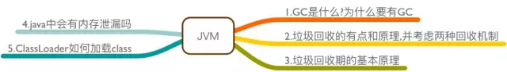
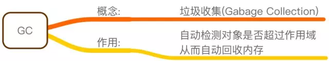
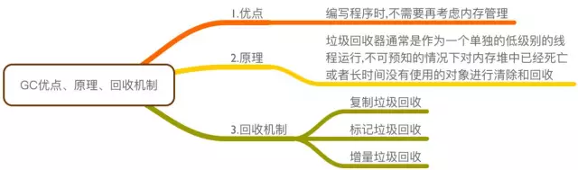
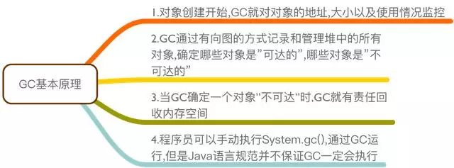
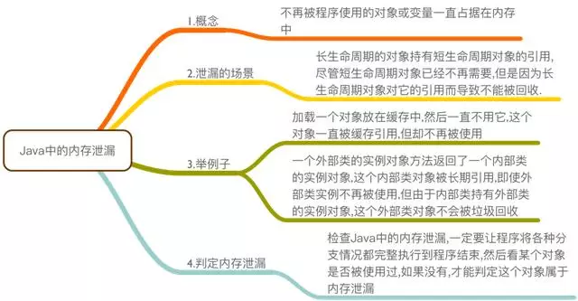
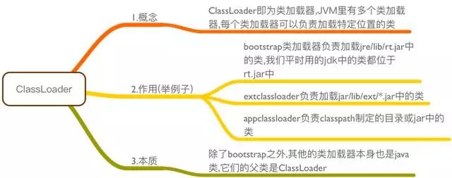
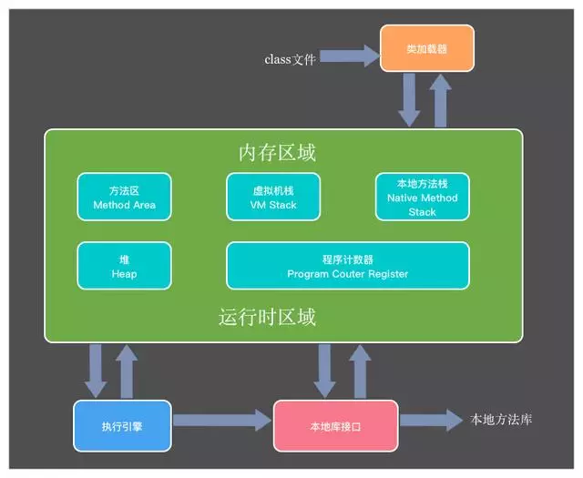

### 1. JRE与JDK的区别？

JRE:java运行时的环境，JDK:包含JRE并且可以查看源码

### 2. Java中的数据类型都有哪些?

分别是8种基本数据类型:byte、short、int、long、float、double、boolean、char

除8种以外统称为引用类型,例如:String类、Object类、数组及自己创建的类等

### 3. 等号“==”与equals的区别？

"=="比较的是栈上的值(基本数据类型比较值的方式)

equlas比较的是堆上的值(引用类型比较值的方式)

### 4. i++与++i的区别？

i++为代码执行后自加1，++i为代码执行前自加1

### 5. break和continue和return的区别？

break:跳出整个循环，continue:跳出本次循环,进入下一次循环，return:跳出方法,结束这个方法,并返回一个数据

### 6. int类型和String类型之间的互相转换?

int -->String常用的方法:

- 字符串拼接

- String b = String.valueof(int a)方法

String -->int常用的方法:

- int i = Integer.valueof(String a)方法

- int i = Integer.parseInt(String a)方法

### 7. &、|与&&、||的区别?

&、| :为位运算符可以进行位运算,符号两边都需要判断才会结束判断,效率低

&&、||:为逻辑判断符用来进行逻辑判断,从左到右判断,一面为否就结束判断,效率高

### 8. swich()语句中小括号能使用String类型数据么?

- 只用JDK1.7版本以后才可以使用String类型数据
- long类型数据任何版本都不可以使用

### 9. 循环都有哪些?

- for循环
- for each循环
- while循环
- do while 循环 (先执行一次)
- 递归(方法自己调用自己)

### 10. 类的结构是什么?

- 成员变量
- 构造器(构造方法)(不可以被static修饰)
- 普通方法
- 代码块
- 内部类

### 11. 图解java面试题 - JVM

内容大纲

GC是什么?为什么要有GC?

垃圾回收的优点和原理,并考虑两种回收机制

垃圾回收器的基本原理是什么

Java中会有内存泄漏吗

ClassLoader如何加载class

JVM内存模型图

