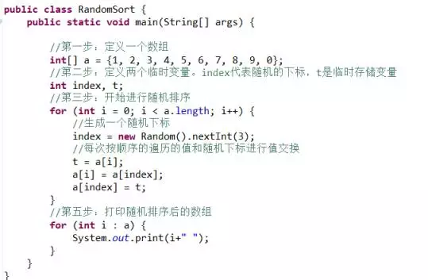
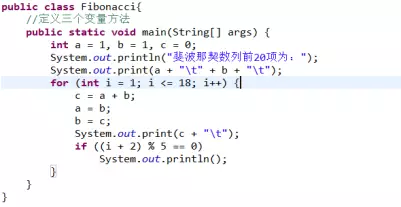
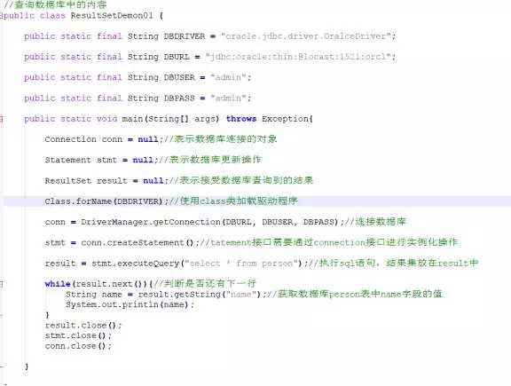

**1.Java泛型中的泛型参数能不能是基本类型，比如ArrayList<T>中的T可不可以是int，为什么？ArrayList<String>中可不可以插入数字，如果可以，请用代码示例，如果不可以，请说明原因？**

答：不能，泛型要求能包容的是对象类型，而基本类型在java里不属于对象。

ArrayList&lt;String>中不可以插入数字，因为他的泛型参数规定是String类型，所以只能插入字符串。但是如果非要插入数字，有三种方法可以解决。比如泛型参数改成Integer，或者不声明泛型类型或者是数字和空字符串拼接。

**2.什么是值传递和引用传递？**

答：值传递：传递的是实际参数的一个副本，这个值可能是基本类型，也可能是引用类型的地址。意思指的是在方法调用时，传递的参数是按值的拷贝传递。

引用传递：传递的是实际参数的地址的一个副本。意思指的是在方法调用时，传递的参数是按引用进行传递，其实传递的引用的地址，也就是变量所对应的内存空间的地址。

在java中，只有值传递.引用传递其实也就是内存地址值的传递。

**3.Java集合类框架的基本接口有哪些？请说明各自的用途**

- Collection：代表一组对象，每一个对象都是它的子元素。
- Set：不包含重复元素的Collection。
- List：有顺序的collection，并且可以包含重复元素。
- Map：可以把键(key)映射到值(value)的对象，键不能重复。

**4.下面的代码中list对象总共扩容了几次，请详细讲述一下ArrayList的扩容规则。**
```java
ArrayList<String> list = new ArrayList<>();

for (int i = 0; i < 20; i++) {
    list.add(Integer.toString(i));
}
```
答：总共扩容了2次。它默认是大小（size）是10个，每次扩容都会比较现在的容量是否够用，如果不够用就扩容1.5倍，调用Arrays.copyOf方法，所以每次扩容都是new一个新的数组！如果一个list初始化容量为10，如果需要添加1000个对象，需要初始化11次，而每次都生成新的数组对象，将原来的对象复制到新数组对象里，就是说每次都要丢弃原来的数组对象，这样的操作确实特别费时又占用内存（虽说只是复制对象的引用，但数组对象本身也是需要占用内存的）。看来如果元素很多的话，估计数量初始化一个容量还是很有必要的。

**5.请详细讲述一下RandomAccess接口有什么作用**

答：RandomAccess用来当标记的，是一种标记接口，接口的非典型用法。意思是，随机访问任意下标元素都比较快。用处，当要实现某些算法时，会判断当前类是否实现了RandomAccess接口，会根据结果选择不同的算法

**6. 请详细讲述一下HashMap的内部实现原理。**

答：HashMap的底层实现都是数组+链表结构实现的。添加、删除、获取元素时都是先计算hash，根据hash和table.length计算index也就是table数组的下标，然后进行相应操作。HashMap创建时会默认初始化时创建一个默认容量为16的Entry数组，默认加载因子为0.75，同时设置临界值为16*0.75。

**7. 请编写一段Java代码，对数组{1, 2, 3, 4, 5, 6, 7, 8, 9, 0}进行随机排序。**

答：代码如下

 

打印后的结果是：

```
8 0 9 2 3 5 4 7 6 1
```

**8. 请用您认为最优的算法计算斐波那契数列：F(n)=F(n-1)+F(n-2) (n为自然数，F(0)=0, F(1)=1)。**

答：



**9. 请详细讲述一下Java中volatile关键字的作用。**

答：用volatile修饰的变量，线程在每次使用变量的时候，都会读取变量修改后的最的值。volatile很容易被误用，用来进行原子性操作。

主要用在多线程，同步变量。 线程为了提高效率，将某成员变量(如A)拷贝了一份（如B），线程中对A的访问其实访问的是B。只在某些动作时才进行A和B的同步。因此存在A和B不一致的情况。volatile就是用来避免这种情况的。volatile告诉jvm， 它所修饰的变量不保留拷贝，直接访问主内存中的（也就是上面说的A)。在Java内存模型中，有main memory，每个线程也有自己的memory (例如寄存器)。为了性能，一个线程会在自己的memory中保持要访问的变量的副本。这样就会出现同一个变量在某个瞬间，在一个线程的memory中的值可能与另外一个线程memory中的值，或者main memory中的值不一致的情况。

一个变量声明为volatile，就意味着这个变量是随时会被其他线程修改的，因此不能将它cache在线程memory中。

**10. 写一段代码在遍历 ArrayList 时移除一个元素。**

答：我们知道ArrayList的底层是用数组实现的，如果你删除了其中一个元素，那么后边的元素都会向前移动。所以在遍历时如果删除元素，就要小心了。

第一种方法，用数组下标进行遍历，如果需要删除元素，我们从后向前遍历，这样不论有没有元素删除，我们都不会遗漏未被遍历的元素。

第二种方法，我们使用迭代器。
```java
Iterator itr = list.iterator();

while(itr.hasNext()) {
      if(...) {
        itr.remove();
      }
}
```
总之，如果你的删除操作比较多的话，建议使用LinkedList。


**11. 请详细解释一下Java泛型中&lt;? super T>和&lt;? extends T>的作用和区别。**

答：&lt;? super T>表示包括T在内的任何T的父类，&lt;? extends T>表示包括T在内的任何T的子类。

遵循一个原则则是，生产者（Producer）使用extends，消费者（Consumer）使用super。

**生产者使用extends**

如果你需要一个列表提供T类型的元素（即你想从列表中读取T类型的元素），你需要把这个列表声明成&lt; extends T>，比如List&lt; extends Integer>，因此你不能往该列表中添加任何元素。

**消费者使用super**

如果需要一个列表使用T类型的元素（即你想把T类型的元素加入到列表中），你需要把这个列表声明成&lt; super T>，比如List&lt; super Integer>，因此你不能保证从中读取到的元素的类型。

即是生产者，也是消费者

如果一个列表即要生产，又要消费，你不能使用泛型通配符声明列表，比如List&lt;Integer>。

**12. 请用JDBC写一段访问数据库读取数据的代码，SL语句和驱动自己选择。**



**13. 请谈谈Proxy模式，Adapter模式，Decorator模式以及Façade模式分别的使用场景和区别。**

答：**Proxy模式**是设计模式中的代理模式，比如我去优衣库买衣服，那么我肯定不会直接去优衣库工厂（生产衣服工厂）去买衣服吧，那么我们直接去门店啊或者代理店去买。这些地方其实就是优衣库造衣工厂的代理。

什么时候开始使用呢？当我们需要使用的对象很复杂或者需要很长时间去构造，这时就可以使用代理模式(Proxy)。例如：如果构建一个对象很耗费时间和计算机资源，代理模式(Proxy)允许我们控制这种情况，直到我们需要使用实际的对象。一个代理(Proxy)通常包含和将要使用的对象同样的方法，一旦开始使用这个对象，这些方法将通过代理(Proxy)传递给实际的对象。 一些可以使用代理模式(Proxy)的情况：

一个对象，比如一幅很大的图像，需要载入的时间很长。　　　　

一个需要很长时间才可以完成的计算结果，并且需要在它计算过程中显示中间结果

一个存在于远程计算机上的对象，需要通过网络载入这个远程对象则需要很长时间，特别是在网络传输高峰期。

一个对象只有有限的访问权限，代理模式(Proxy)可以验证用户的权限

代理模式(Proxy)也可以被用来区别一个对象实例的请求和实际的访问，例如：在程序初始化过程中可能建立多个对象，但并不都是马上使用，代理模式(Proxy)可以载入需要的真正的对象。这是一个需要载入和显示一幅很大的图像的程序，当程序启动时，就必须确定要显示的图像，但是实际的图像只能在完全载入后才可以显示！这时我们就可以使用代理模式(Proxy)。

**Adapter模式**是设计模式的适配器模式,它主要是将一个类的接口转换成客户希望的另外一个接口。Adapter模式使得原本由于接口不兼容而不能一起工作的那些类可以在一起工作。

使用场景即系统需要使用现有的类，而这些类的接口不符合系统的接口。

想要建立一个可以重用的类，用于与一些彼此之间没有太大关联的一些类，包括一些可能在将来引进的类一起工作。

两个类所做的事情相同或相似，但是具有不同接口的时候。

旧的系统开发的类已经实现了一些功能，但是客户端却只能以另外接口的形式访问，但我们不希望手动更改原有类的时候。

使用第三方组件，组件接口定义和自己定义的不同，不希望修改自己的接口，但是要使用第三方组件接口的功能。

**Decorator模式**即设计模式中的装饰器模式。它能动态地给一个对象添加一些额外的职责或者行为。就增加功能来说， Decorator模式相比生成子类更为灵活。它提供了改变子类的灵活方案。装饰器模式在不必改变原类文件和使用继承的情况下，动态的扩展一个对象的功能。它是通过创建一个包装对象，也就是装饰来包裹真实的对象。

当用于一组子类时，装饰器模式更加有用。如果你拥有一族子类（从一个父类派生而来），你需要在与子类独立使用情况下添加额外的特性，你可以使用装饰器模式，以避免代码重复和具体子类数量的增加。

**Façade模式**即设计模式的外观设计模式。它为子系统中的一组接口提供一个一致的界面，Facade模式定义了一个高层接口，这个接口使得这一子系统更加容易使用。

应用场景是

当你要为一个复杂子系统提供一个简单接口时。

客户程序与抽象类的实现部分之间存在着很大的依赖性。

当你需要构建一个层次结构的子系统时，使用Facade模式定义子系统中每层的入口点。仅通过facade进行通讯。

**14. OOP的基本特性和设计原则有哪些。**

答：OOP的三大基本特性是抽象与封装，继承与多态。

**1.抽象与封装:**

抽象是把系统中需要处理的数据和在这些数据上的操作结合在一起，根据功能、性质和用途等因素抽象成不同的抽象数据类型。每个抽象数据类型既包含了数据，又包含了针对这些数据的授权操作。在面向对象的程序设计中，抽象数据类型是用“类”这种结构来实现的，每个类里都封装了相关的数据和操作。

封装是指利用抽象数据类型和基于数据的操作结合在一起，数据被保护在抽象数据类型的内部，系统的其他部分只有通过包裹在数据之外被授权的操作，才能与这个抽象数据类型进行交互。

**2. 继承：**

它是与传统方法不同的一个最有特色的方法。它是面向对象的程序中两个类之间的一种关系，即一个类可以从另一个类（即它的父类）继承状态和行为。继承父类的类称为子类。

继承的优越性：通过使用继承，程序员可以在不同的子类中多次重新使用父类中的代码，使程序结构清晰，易于维护和修改，而子类又可以提供一些特殊的行为，这些特殊的行为在父类中是没有的 

**3.多态：**

是指一个程序中同名的方法共存的情况，调用者只需使用同一个方法名，系统会根据不同情况，调用相应的不同方法，从而实现不同的功能。多态性又被称为“一个名字，多个方法”。

设计原则有五种：

**单一职责原则(Single-Resposibility Principle)**。"对一个类而言，应该仅有一个引起它变化的原因。"本原则是我们非常熟悉地"高内聚性原则"的引申，但是通过将"职责"极具创意地定义为"变化的原因"，使得本原则极具操作性，尽显大师风范。同时，本原则还揭示了内聚性和耦合生，基本途径就是提高内聚性；如果一个类承担的职责过多，那么这些职责就会相互依赖，一个职责的变化可能会影响另一个职责的履行。其实OOD的实质，就是合理地进行类的职责分配。

**开放封闭原则(Open-Closed principle)。**"软件实体应该是可以扩展的，但是不可修改。"本原则紧紧围绕变化展开，变化来临时，如果不必改动软件实体裁的源代码，就能扩充它的行为，那么这个软件实体设计就是满足开放封闭原则的。如果说我们预测到某种变化，或者某种变化发生了，我们应当创建抽象类来隔离以后发生的同类变化。在Java中，这种抽象是指抽象基类或接口；在C++中，这各抽象是指抽象基类或纯抽象基类。当然，没有对所有情况都贴切的模型，我们必须对软件实体应该面对的变化做出选择。

**Liskov替换原则(Liskov-Substituion Principle)**。"子类型必须能够替换掉它们的基类型。"本原则和开放封闭原则关系密切，正是子类型的可替换性，才使得使用基类型模块无需修改就可扩充。Liskov替换原则从基于契约的设计演化而来，契约通过为每个方法声明"先验条件"和"后验条件"；定义子类时，必须遵守这些"先验条件"和"后验条件"。当前基于契的设计发展势头正劲，对实现"软件工厂"的"组装生产"梦想是一个有力的支持。

**依赖倒置原则(Dependecy-Inversion Principle)。**"抽象不应依赖于细节，细节应该依赖于抽象。"本原则几乎就是软件设计的正本清源之道。因为人解决问题的思考过程是先抽象后具体，从笼统到细节，所以我们先生产出的势必是抽象程度比较高的实体，而后才是更加细节化的实体。于是，"细节依赖于抽象"就意味着后来的依赖于先前的，这是自然而然的重用之道。而且，抽象的实体代表着笼而统之的认识，人们总是比较容易正确认识它们，而且本身也是不易变的，依赖于它们是安全的。依赖倒置原则适应了人类认识过程的规律，是面向对象设计的标志所在。

**接口隔离原则(Interface-Segregation Principle)。**"多个专用接口优于一个单一的通用接口。"本原则是单一职责原则用于接口设计的自然结果。一个接口应该保证，实现该接口的实例对象可以只呈现为单一的角色；这样，当某个客户程序的要求发生变化，而迫使接口发生改变时，影响到其他客户程序的可能生性小。

良性依赖原则。"不会在实际中造成危害的依赖关系，都是良性依赖。"通过分析不难发现，本原则的核心思想是"务实"，很好地揭示了极限编程(Extreme Programming)中"简单设计"各"重构"的理论基础。本原则可以帮助我们抵御"面向对象设计五大原则"以及设计模式的诱惑，以免陷入过度设计(Over-engineering)的尴尬境地，带来不必要的复杂性。

**15. 请谈谈Java中的多线程相关的内容以及各种相关的锁。**

答：实现Java中的多线程有两种方式。一是直接继承Thread类，二是实现Runnable接口。通常我们实现Runnabale接口方式去做。好处如下：

(1)适合多个相同程序代码的线程去处理同一资源的情况，把虚拟CPU（线程）同程序的代码，数据有效的分离，较好地体现了面向对象的设计思想。

(2)可以避免由于Java的单继承特性带来的局限。我们经常碰到这样一种情况，即当我们要将已经继承了某一个类的子类放入多线程中，由于一个类不能同时有两个父类，所以不能用继承Thread类的方式，那么，这个类就只能采用实现Runnable接口的方式了。

(3)有利于程序的健壮性，代码能够被多个线程共享，代码与数据是独立的。当多个线程的执行代码来自同一个类的实例时，即称它们共享相同的代码。 多个线程操作相同的数据，与它们的代码无关。当共享访问相同的对象是，即它们共享相同的数据。当线程被构造时，需要的代码和数据通过一个对象作为构造函数 实参传递进去，这个对象就是一个实现了Runnable接口的类的实例

Java中多线程的状态是

1.新建状态（New）：新创建了一个线程对象。

2.就绪状态（Runnable）：线程对象创建后，其他线程调用了该对象的start()方法。该状态的线程位于可运行线程池中，变得可运行，等待获取CPU的使用权。

3.运行状态（Running）：就绪状态的线程获取了CPU，执行程序代码。

4.阻塞状态（Blocked）：阻塞状态是线程因为某种原因放弃CPU使用权，暂时停止运行。直到线程进入就绪状态，才有机会转到运行状态。阻塞的情况分三种：

等待阻塞：运行的线程执行wait()方法，JVM会把该线程放入等待池中。

同步阻塞：运行的线程在获取对象的同步锁时，若该同步锁被别的线程占用，则JVM会把该线程放入锁池中。

其他阻塞：运行的线程执行sleep()或join()方法，或者发出了I/O请求时，JVM会把该线程置为阻塞状态。当sleep()状态超时、join()等待线程终止或者超时、或者I/O处理完毕时，线程重新转入就绪状态。

5.死亡状态（Dead）：线程执行完了或者因异常退出了run()方法，该线程结束生命周期。

Java多线程锁有对象锁和类锁。对象级别锁是一个机制，当你想同步一个非静态方法或者非静态代码块，让在给定的类实例中只有一个线程来执行这个代码块，这就可以使得实例级别的数据是线程安全的。类级别锁是在所有可变的实例或者运行环境中，类级别锁阻止多线程进入同步块，也就是说，如果运行环境中有DemoClass的100个实例，在任何时刻，只能有DemoClass的一个实例来执行它的demoMethod()方法，所有其他的DemoClass实例在其他线程中只能处于阻塞状态，这使得静态数据是线程安全的。