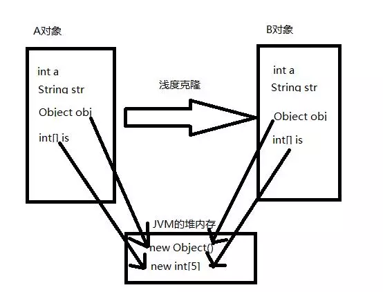
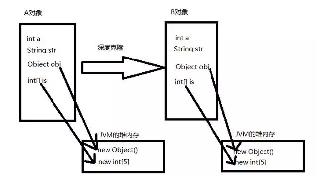
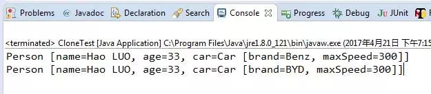

“纵使面试无数，难敌考官吃素“，昨天去乐视面试，遇到一个从来没有遇到过的考题！

## 请分别实现深度和浅读的对象克隆？

原理：深度克隆和浅度克隆，Object中的克隆方法是浅度克隆。JDK规定了克隆需要满足的一些条件，简要总结一下就是：对某个对象进行克隆，对象的的成员变量如果包括引用类型或者数组，那么克隆的时候其实是不会把这些对象也带着复制到克隆出来的对象里面的，只是复制一个引用，这个引用指向被克隆对象的成员对象，但是基本数据类型是会跟着被带到克隆对象里面去的。而深度可能就是把对象的所有属性都统统复制一份新的到目标对象里面去。简单画个对比图：





## 实现方式

- 实现Serializable接口，通过对象的序列化和反序列化实现克隆，可以实现真正的深度克隆；

- 实现Cloneable接口并重写Object类中的clone()方法，即可实现浅度克隆。

代码

Car.java
```java
public class Car implements Serializable {
    
    private static final long serialVersionUID = 1L;
    
    private String brand;//品牌
    private int maxSpeed;//最高时速

    public Car(String brand, int maxSpeed) {
        this.brand = brand;
        this.maxSpeed = maxSpeed;
    }

    public String getBrand() {
        return brand;
    }

    public void setBrand(String brand) {
        this.brand = brand;
    }

    public int getMaxSpeed() {
        return maxSpeed;
    }

    public void setMaxSpeed(int maxSpeed) {
        this.maxSpeed = maxSpeed;
    }

    @Override
    public String toString() {
        return "Car{" +
                "brand='" + brand + '\'' +
                ", maxSpeed=" + maxSpeed +
                '}';
    }
}
```
Person.java
```java
public class Person implements Serializable {
    private static final long serialVersionUID = 1L;

    private String name;//姓名
    private int age;//年龄
    private Car car;//座驾

    public Person(String name, int age, Car car) {
        this.name = name;
        this.age = age;
        this.car = car;
    }

    public String getName() {
        return name;
    }

    public void setName(String name) {
        this.name = name;
    }

    public int getAge() {
        return age;
    }

    public void setAge(int age) {
        this.age = age;
    }

    public Car getCar() {
        return car;
    }

    public void setCar(Car car) {
        this.car = car;
    }

    @Override
    public String toString() {
        return "Person{" +
                "name='" + name + '\'' +
                ", age=" + age +
                ", car=" + car +
                '}';
    }
}
```
Person2.java
```java
public class Person2 implements Serializable {
    private static final long serialVersionUID = 1L;

    private String name;//姓名
    private int age;//年龄
    private Car car;//座驾

    public Person2(String name, int age, Car car) {
        this.name = name;
        this.age = age;
        this.car = car;
    }

    public String getName() {
        return name;
    }

    public void setName(String name) {
        this.name = name;
    }

    public int getAge() {
        return age;
    }

    public void setAge(int age) {
        this.age = age;
    }

    public Car getCar() {
        return car;
    }

    public void setCar(Car car) {
        this.car = car;
    }

    @Override
    protected Object clone(){
        Person2 s= null;
        try {
            s = (Person2) Person2.super.clone();
        } catch (CloneNotSupportedException e) {
            e.printStackTrace();
        }
        return s;
    }

    @Override
    public String toString() {
        return "Person{" +
                "name='" + name + '\'' +
                ", age=" + age +
                ", car=" + car +
                '}';
    }
}
```
CloneUtil.java
```java
public class CloneUtil {

    private CloneUtil() {
        throw new AssertionError();
    }
    
    public static <T extends Serializable> T clone(T object) throws IOException, 
            ClassNotFoundException {
        // 说明：调用ByteArrayOutputStream或ByteArrayInputStream对象的close方法没有任何意义
        // 这两个基于内存的流只要垃圾回收器清理对象就能够释放资源，这一点不同于对外资源(如文件流)的释放
        ByteArrayOutputStream baos = new ByteArrayOutputStream();
        ObjectOutputStream oos = new ObjectOutputStream(baos);
        oos.writeObject(object);

        ByteArrayInputStream bais = new ByteArrayInputStream(baos.toByteArray());
        ObjectInputStream ois = new ObjectInputStream(bais);
        return (T) ois.readObject();
    }
}
```
CloneTest
```java
public class CloneTest {
    public static void main(String[] args){
        try {
            // 深拷贝
            Person p1 = new Person("xiaoming",18,new Car("Benz",300));
            Person p2 = CloneUtil.clone(p1);
            // 修改克隆的Person对象p2关联的汽车对象的品牌属性
            // 原来的Person对象p1关联的汽车不会受到任何影响，还是Benz
            // 因为在克隆Person对象时其关联的汽车对象也被克隆了
            
            p2.setAge(25);
            p2.getCar().setBrand("BYD");
            
            System.out.println(p1);

            Person2 p3 = new Person2("xiaoming",18,new Car("Benz",300));
            Person2 p4 = (Person2) p3.clone();
            p4.setAge(25);
            p4.getCar().setBrand("BYD");

            System.out.println(p3);
        } catch (Exception e) {
            e.printStackTrace();
        }
    }
}
```
结果
