### 源码分析相关面试题

- [Volley源码分析](http://blog.csdn.net/mwq384807683/article/details/71305969)
- [注解框架实现原理](http://blog.csdn.net/mwq384807683/article/details/70795881)
- [okhttp3.0源码分析](http://blog.csdn.net/mwq384807683/article/details/71173442)

### 与XMPP相关面试题

- [与XMPP相关试题一](http://blog.csdn.net/mwq384807683/article/details/70313802)
- [与XMPP相关试题二](http://blog.csdn.net/mwq384807683/article/details/70313827)

### 与性能优化相关面试题

- [与性能优化相关面试题一](http://blog.csdn.net/mwq384807683/article/details/70313673)
- [与性能优化相关面试题二](http://blog.csdn.net/mwq384807683/article/details/70313685)
- [与性能优化相关面试题三](http://blog.csdn.net/mwq384807683/article/details/70313721)
- [与性能优化相关面试题四](http://blog.csdn.net/mwq384807683/article/details/70313741)
- [与性能优化相关面试题五](http://blog.csdn.net/mwq384807683/article/details/70313763)
- [与性能优化相关面试题六](http://blog.csdn.net/mwq384807683/article/details/70670846)
- [与IPC机制相关面试题](http://blog.csdn.net/mwq384807683/article/details/70313632)

### 与登录相关面试题

- [oauth认证协议原理](http://blog.csdn.net/mwq384807683/article/details/70313871)
- [token产生的意义](http://blog.csdn.net/mwq384807683/article/details/70840226)
- [微信扫一扫实现原理](http://blog.csdn.net/mwq384807683/article/details/70313849)

### 与开发相关面试题

- [迭代开发的时候如何向前兼容新旧接口](http://blog.csdn.net/mwq384807683/article/details/70470403)
- [手把手教你如何解决as jar包冲突](http://blog.csdn.net/mwq384807683/article/details/71402900)
- [context的原理分析](http://blog.csdn.net/mwq384807683/article/details/70670431)

### 与人事相关面试题

- [人事面试宝典](http://blog.csdn.net/mwq384807683/article/details/71435960)

### 本文配套视频

- [静默安装原理一](https://v.qq.com/x/page/k0501fbjwcv.html)
- [静默安装原理二](https://v.qq.com/x/page/f0501jbulwc.html)

很多哥们在后台公众号留言，让讲讲如何编译源码，感觉源码开发很神秘，好吧，今天就手把手教大家安装虚拟机编译源码，文字部分的东西就别看了，毕竟源码或者技术这种东西三言两语也讲不明白，直接看视频吧，通过本文我录制的视频希望对大家能起到抛砖引玉的作用，不过这个视频是我在三年前录制的，讲的是通过源码编译不需要root权限实现静默安装和偷拍，然后也把[Android](http://lib.csdn.net/base/android)系统安装源码给大家分析了，毕竟三年前随堂录制的视频，也比较简单的东西，如果没有收获随便看看就行，有收获点个赞就行，对静默安装感兴趣就从第一个视频开始看起，如果只是单纯对源码编译感兴趣，直接从第二个视频15分钟开始看就行，这样能节约大家的时间，视频时间有点长。

四年前写的静默安装代码，有兴趣看看吧：[http://www.apkbus.com/forum.php?mod=viewthread&tid=120895](http://www.apkbus.com/forum.php?mod=viewthread&tid=120895)

# Android源码分析

### 1. 了解虚拟机的的使用

Android 系统的编译环境目前只支持 [Linux](https://lib.csdn.net/base/linux) 以及 Mac OS 两种[操作系统](https://lib.csdn.net/base/operatingsystem) 
虚拟机可以很方便的搭建不同系统的开发环境 
虚拟机可以完整的模拟一台电脑 
虚拟机中的系统独立于主系统存在，子系统的损坏与否不影响主系统功能

#### 1.1. 了解虚拟机的安装和创建新虚拟机的方法

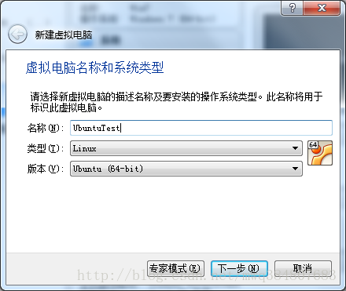

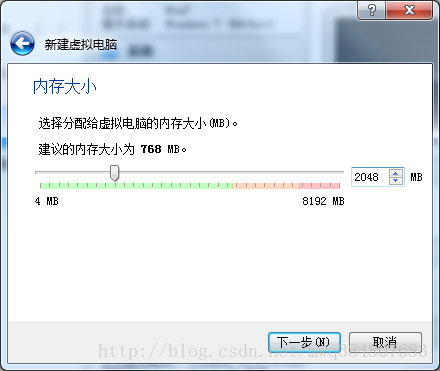

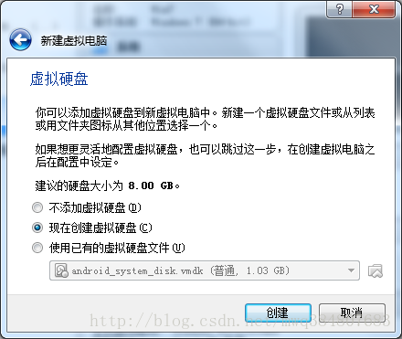

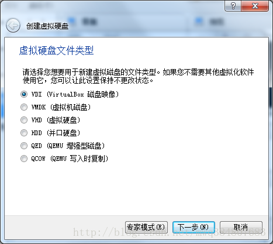

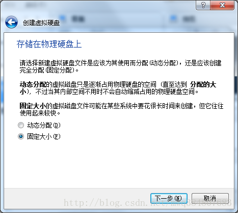

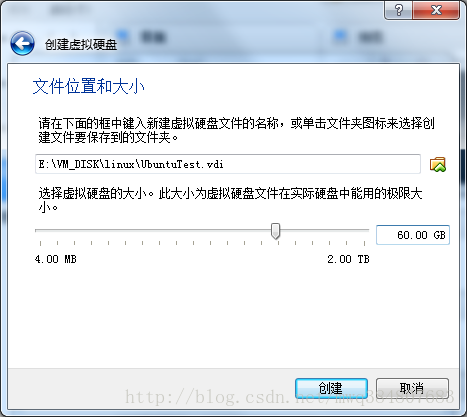

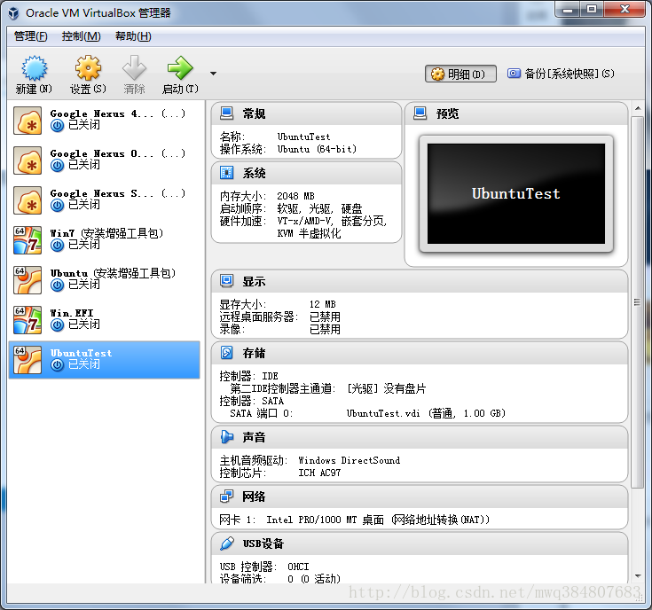

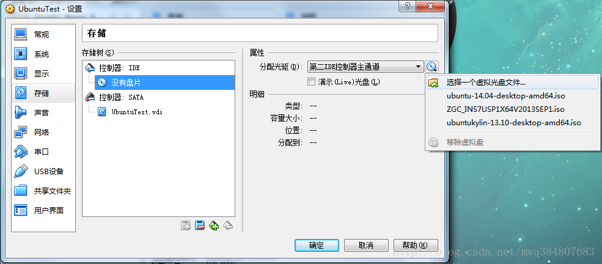

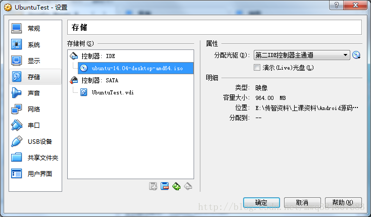

#### 1.2. 了解虚拟机里安装Ubuntu系统的方法

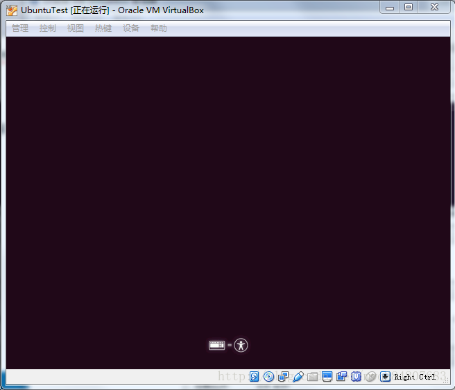

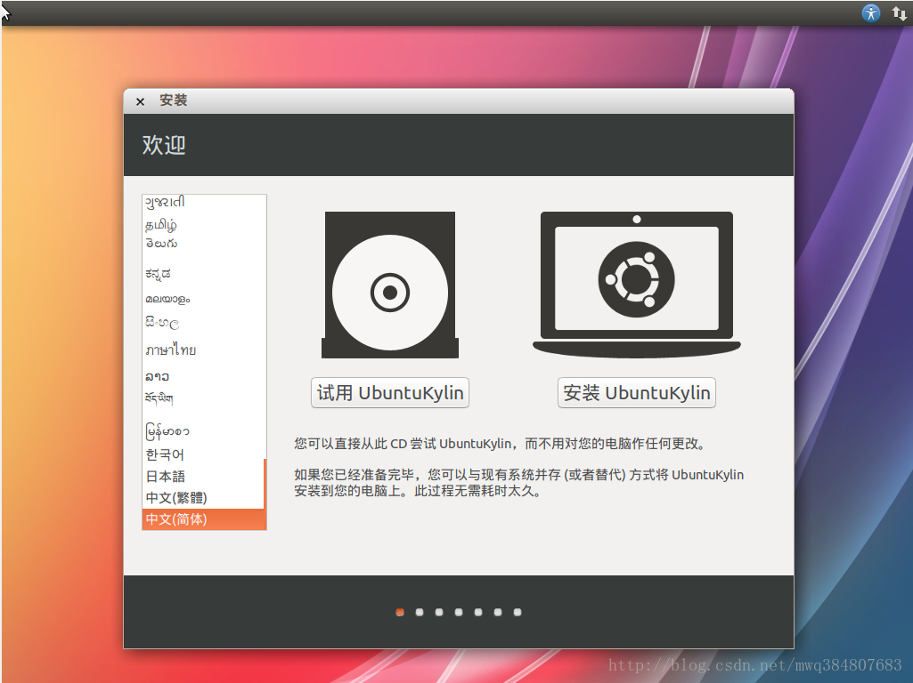

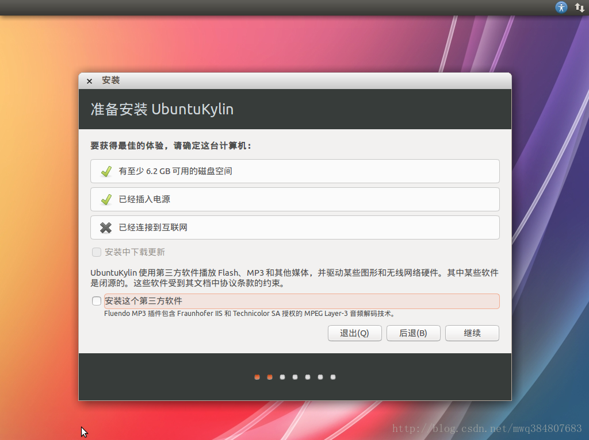

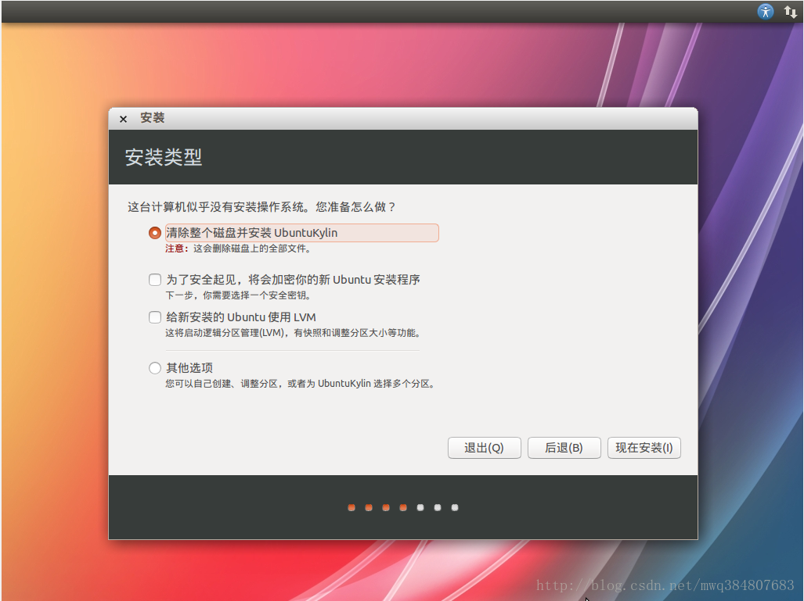

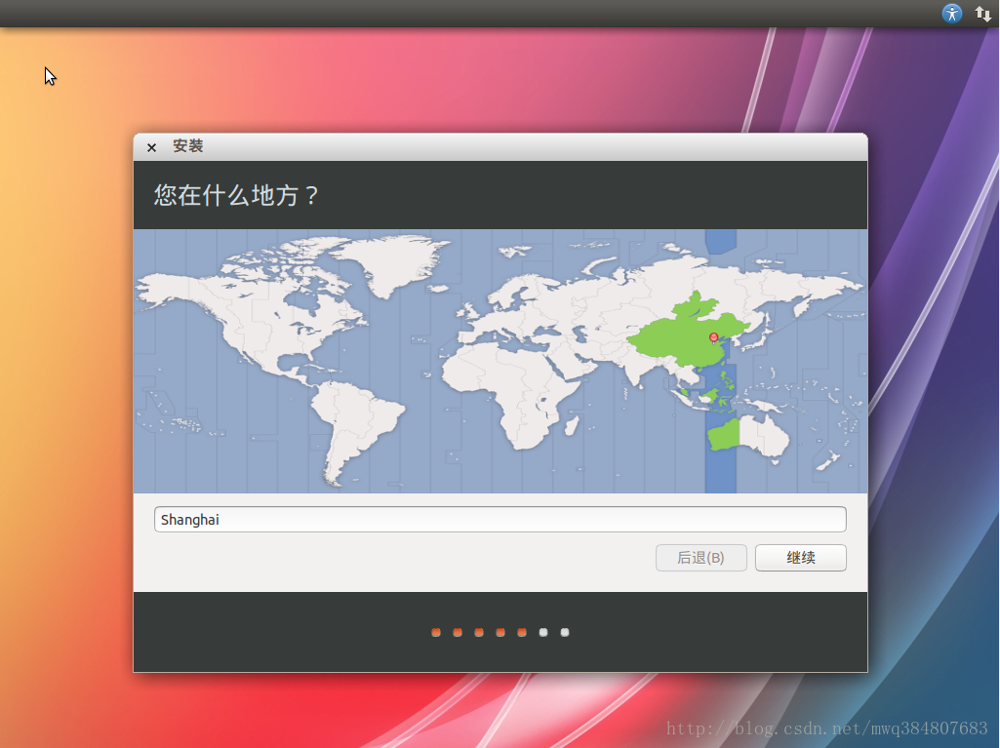

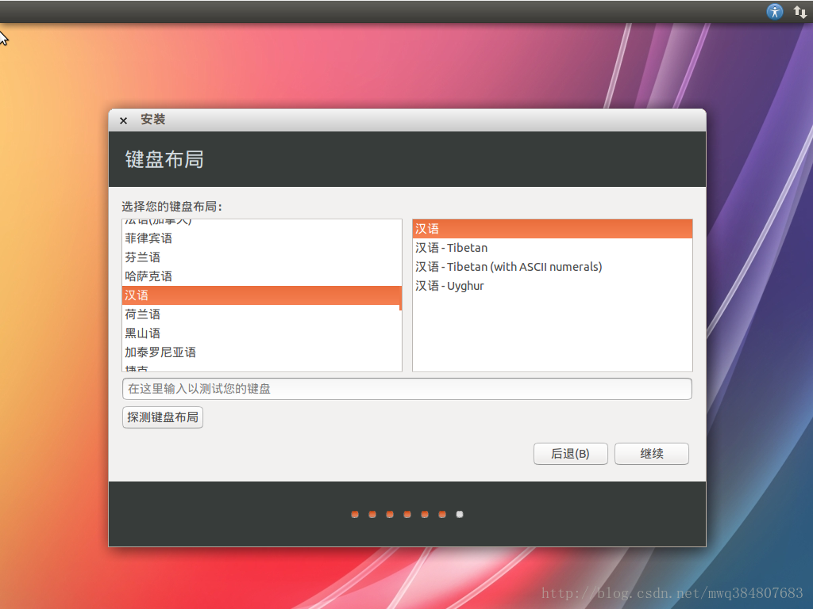

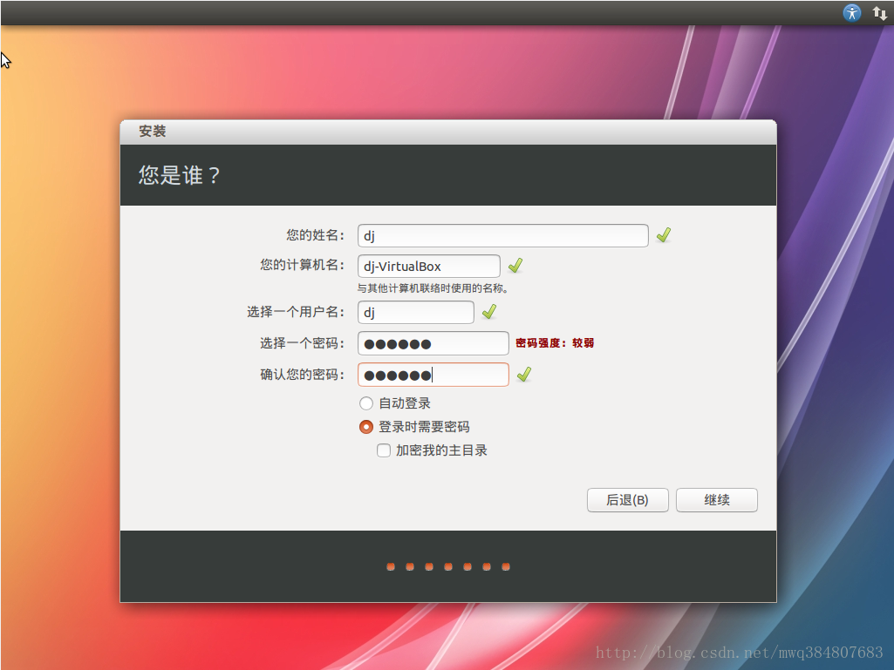

# Android源码下载

> Android源码下载支持的系统目前只有Ubuntu和Mac OS两种操作系统, 本次以Ubuntu系统为例.
>
> 官方网站: [https://source.android.com/source/downloading.html](https://source.android.com/source/downloading.html)

1. 下载[Git](https://lib.csdn.net/base/git)([版本控制](https://lib.csdn.net/base/git)工具). 调出命令行: ctrl + alt + T

```
sudo apt-get install git
```

2. 安装curl(上传和下载数据的工具).

```
sudo apt-get install curl
```

3. 安装repo(一个基于git的版本库管理工具, 这里用于自动批量下载android整个项目.).

```
// 创建目录
mkdir bin

// 下载repo脚本到本地bin文件夹下
curl https://android.git.kernel.org/repo >~/bin/repo
// 如果上面下载失败, 采用下面这种方式
curl "https://php.webtutor.pl/en/wp-content/uploads/2011/09/repo" >~/bin/repo

// 给所有用户追加可执行的权限
chmod a+x ~/bin/repo

// 临时把repo添加到环境变量中, 方便后面执行.
// 注意: 每次重启ubuntu之后此环境变量失效, 重新配置就可以了.
export PATH=~/bin:$PATH

```

4. 创建文件夹, 用于存放下载的Android源码.

```
// 创建目录
mkdir android_source 

// 修改权限
chmod 777 android_source

cd android_source

```

5. 初始化库.

```
// 需要先配置git的用户信息
git config --global user.email "ad_307@yeah.net"
git config --global user.name "liyindong"

repo init -u httpss://android.googlesource.com/platform/manifest -b android-2.3_r1

// 如果上面初始化失败, 用下面的代码
repo init -u git://codeaurora.org/platform/manifest.git -b gingerbread
// 或
repo init -u git://android.git.kernel.org/platform/manifest.git -b  gingerbread

```

###### 出现以下信息成功初始化

```
repo initialized in /home/liyindong/android_source
```

6. 开始同步下载.

```
repo sync
```

**注意: 下载过程中, 因为网络问题, 可能会中断下载. 当中断下载时, 继续使用repo sync命令继续下载.**

# Android源码编译

### 在编译源码之前需要做一些准备操作, 详细步骤如下:

> #### 1. 安装JDK, google官方要求编译2.3源码需要JDK1.6.

- 1). 下载JDK1.6, 下载地址:[https://download.oracle.com/otn/java/jdk/6u45-b06/jdk-6u45-linux-x64.bin](https://download.oracle.com/otn/java/jdk/6u45-b06/jdk-6u45-linux-x64.bin)

- 2). 创建目录.

```
sudo mkdir /usr/java
```

- 3). 把下载好的jdk-6u45-linux-x64.bin拷贝到上面创建的目录下.

```
sudo cp /home/liyindong/jdk-6u45-linux-x64.bin /usr/java
```

- 4). 添加可执行权限.

```
sudo chmod 755 /usr/java/jdk-6u45-linux-x64.bin
```

- 5). 解压.

```
cd /usr/java
sudo ./jdk-6u45-linux-x64.bin
```

- 6). 配置环境变量.

```
export JAVA_HOME=/usr/java/jdk1.6.0_45
export PATH=$PATH:$JAVA_HOME/bin
export CLASSPATH=.:$JAVA_HOME/lib/dt.jar:$JAVA_HOME/lib/tools.jar
```

- 7). 验证是否成功.

```
liyindong@liyindong-VirtualBox:~$ java -version
java version "1.6.0_45"
Java(TM) SE Runtime Environment (build 1.6.0_45-b06)
Java HotSpot(TM) 64-Bit Server VM (build 20.45-b01, mixed mode)
```

> #### 2. 安装其他编译时依赖的软件.
>
> #### 注意: ubuntu自带的源中速度比较慢, 有些软件找不到, 所以需要修改为国内的源, 修改源步骤如下:

- 1). 备份ubuntu自带的源.

```
sudo cp /etc/apt/sources.list /etc/apt/sources.list.old
```

- 2). 修改源文件.

```
sudo gedit /etc/apt/sources.list
```

- 3). 这时会弹出一个文本编辑框, 先删除所有内容, 然后把以下内容拷贝进去, 并保存.

```
deb https://mirrors.163.com/ubuntu/ trusty main restricted universe multiverse
deb https://mirrors.163.com/ubuntu/ trusty-security main restricted universe multiverse
deb https://mirrors.163.com/ubuntu/ trusty-updates main restricted universe multiverse
deb https://mirrors.163.com/ubuntu/ trusty-proposed main restricted universe multiverse
deb https://mirrors.163.com/ubuntu/ trusty-backports main restricted universe multiverse
deb-src https://mirrors.163.com/ubuntu/ trusty main restricted universe multiverse
deb-src https://mirrors.163.com/ubuntu/ trusty-security main restricted universe multiverse
deb-src https://mirrors.163.com/ubuntu/ trusty-updates main restricted universe multiverse
deb-src https://mirrors.163.com/ubuntu/ trusty-proposed main restricted universe multiverse
deb-src https://mirrors.163.com/ubuntu/ trusty-backports main restricted universe multiverse

deb https://mirrors.sohu.com/ubuntu/ trusty main restricted universe multiverse
deb https://mirrors.sohu.com/ubuntu/ trusty-security main restricted universe multiverse
deb https://mirrors.sohu.com/ubuntu/ trusty-updates main restricted universe multiverse
deb https://mirrors.sohu.com/ubuntu/ trusty-proposed main restricted universe multiverse
deb https://mirrors.sohu.com/ubuntu/ trusty-backports main restricted universe multiverse
deb-src https://mirrors.sohu.com/ubuntu/ trusty main restricted universe multiverse
deb-src https://mirrors.sohu.com/ubuntu/ trusty-security main restricted universe multiverse
deb-src https://mirrors.sohu.com/ubuntu/ trusty-updates main restricted universe multiverse
deb-src https://mirrors.sohu.com/ubuntu/ trusty-proposed main restricted universe multiverse
deb-src https://mirrors.sohu.com/ubuntu/ trusty-backports main restricted universe multiverse

deb https://mirrors.oschina.net/ubuntu/ trusty main restricted universe multiverse
deb https://mirrors.oschina.net/ubuntu/ trusty-backports main restricted universe multiverse
deb https://mirrors.oschina.net/ubuntu/ trusty-proposed main restricted universe multiverse
deb https://mirrors.oschina.net/ubuntu/ trusty-security main restricted universe multiverse
deb https://mirrors.oschina.net/ubuntu/ trusty-updates main restricted universe multiverse
deb-src https://mirrors.oschina.net/ubuntu/ trusty main restricted universe multiverse
deb-src https://mirrors.oschina.net/ubuntu/ trusty-backports main restricted universe multiverse
deb-src https://mirrors.oschina.net/ubuntu/ trusty-proposed main restricted universe multiverse
deb-src https://mirrors.oschina.net/ubuntu/ trusty-security main restricted universe multiverse
deb-src https://mirrors.oschina.net/ubuntu/ trusty-updates main restricted universe multiverse

```

- 4). 保存之后, 更新数据源.

```
sudo apt-get update
```

- #### 执行完上面几步, 数据源就更新完成了, 下面就开始安装编译依赖的软件, 同样, 在终端中以行为单位依次输入以下命令:

```
sudo apt-get install gnupg
sudo apt-get install flex
sudo apt-get install bison
sudo apt-get install gperf
sudo apt-get install zip
sudo apt-get install curl
sudo apt-get install build-essential
sudo apt-get install libesd0-dev
sudo apt-get install libwxgtk2.6-dev
sudo apt-get install libsdl-dev
sudo apt-get install lsb-core
sudo apt-get install lib32readline-gplv2-dev
sudo apt-get install g++-multilib
sudo apt-get install lib32z1-dev
sudo apt-get install libswitch-perl

```

> #### 3. 开始编译, 在源码的目录下, 执行一下命令:

```
make
```

### 5. 了解SourceInsight的使用方法

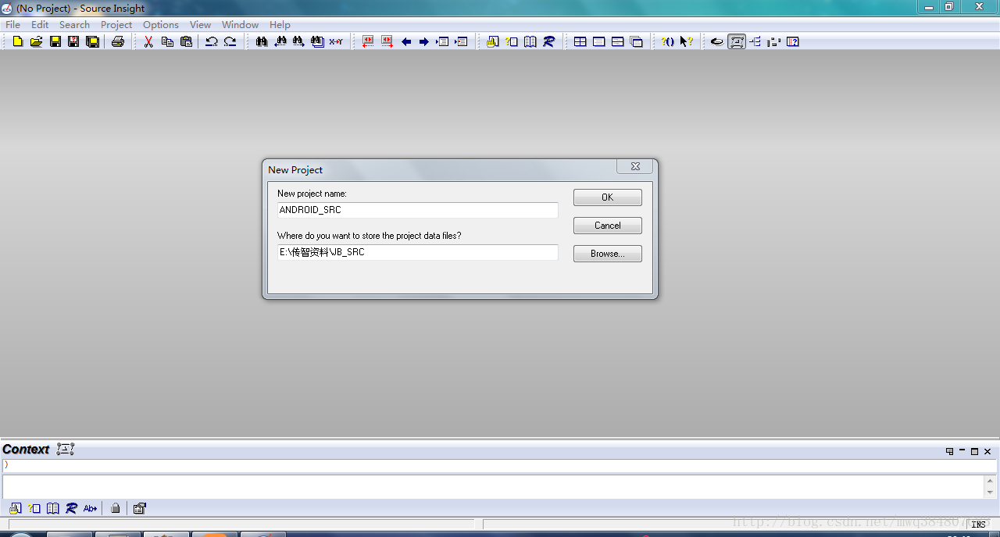

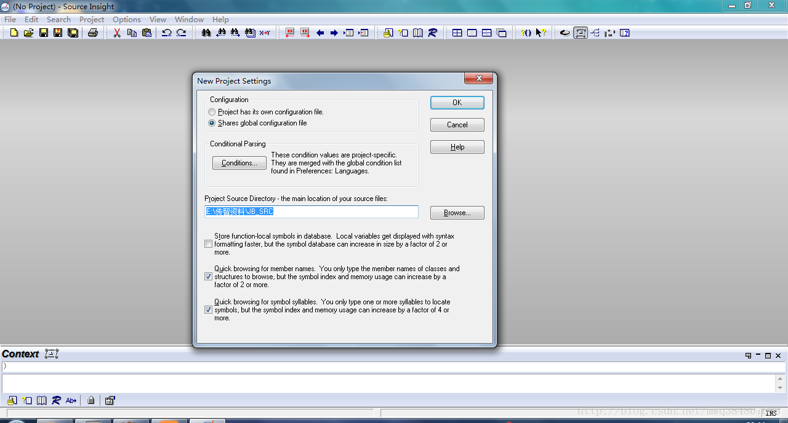

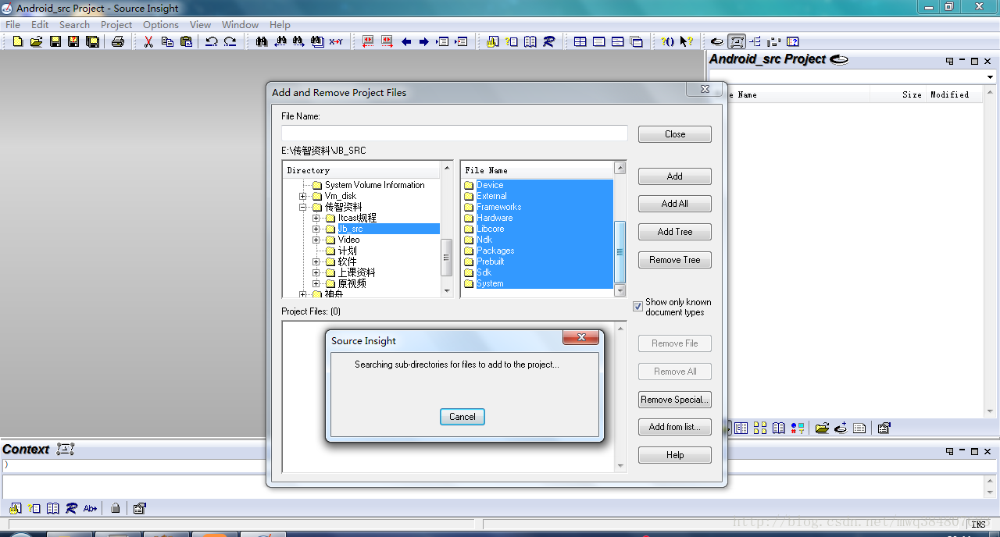

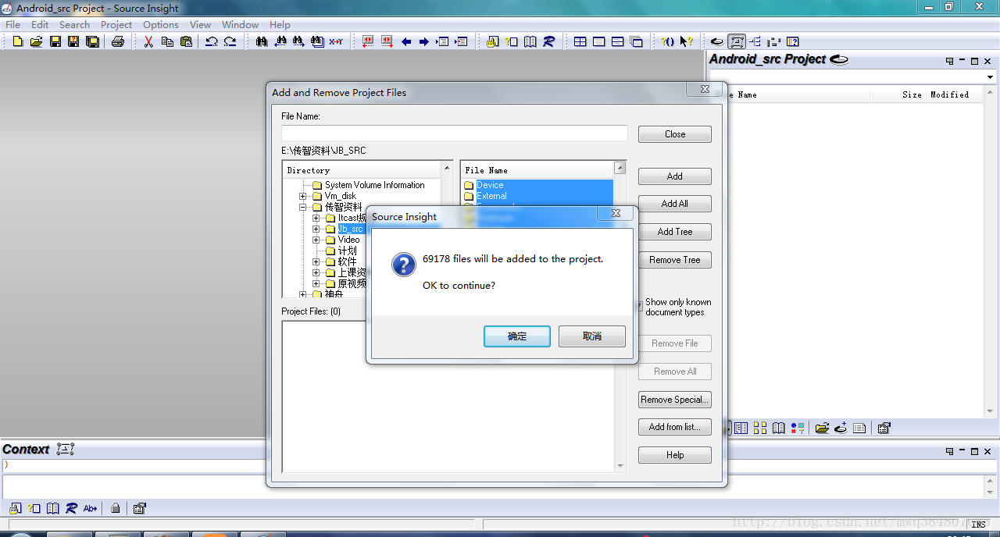

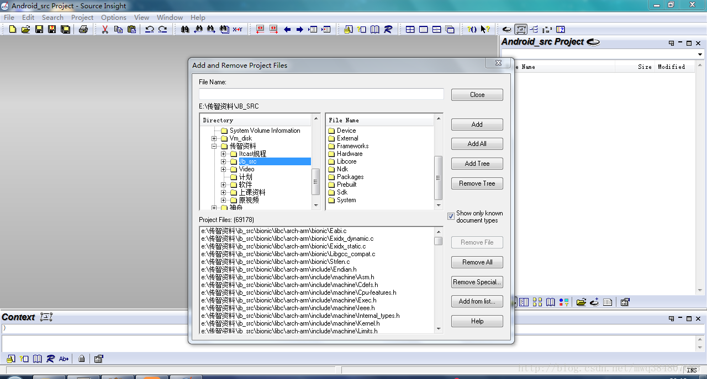

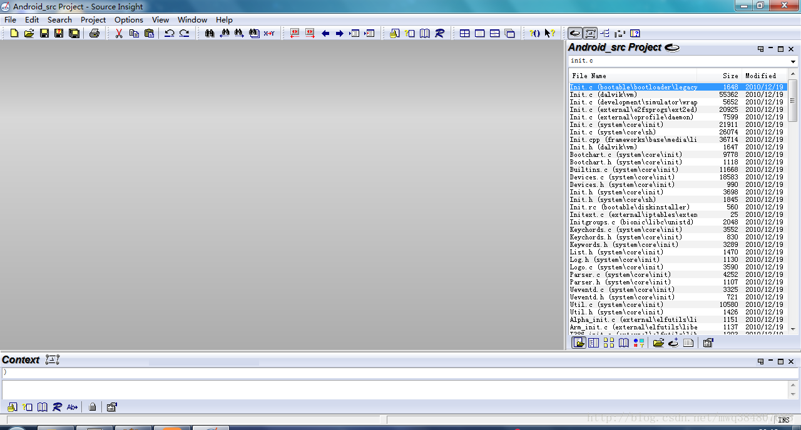

- 欢迎关注微信公众号,长期推荐技术文章和技术视频
- 微信公众号名称：Android干货程序员

