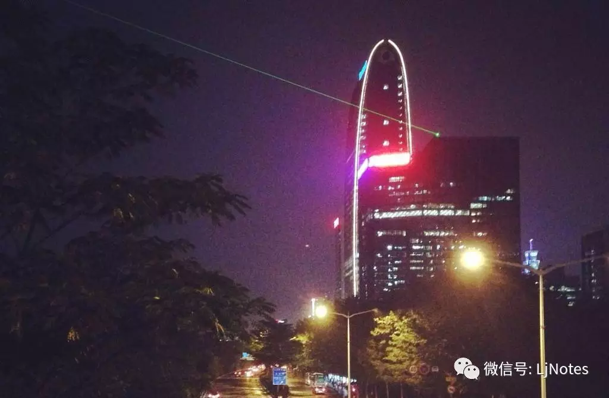
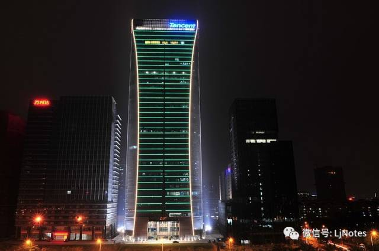

> 来源：微信公众号「LJ 说」，id：「LjNotes」。

“你居然要从腾讯离职了！？”

这是身边朋友得知我要离开后的反应，似乎大家都难以理解这样的决定。

从行业环境来看，中国互联网正处于一派繁荣之境；从公司形势来看，也正要准备大刀阔斧地干一番大事业；从个人发展来看，自己在公司也会担任越来越重要的角色。

所有的环境都是好的，更加显得离职的决策不理智。

HR 系统弹窗给出最后的挽留：你确定要提交离职申请吗？

经过各种综合考虑后，我还是点了“确定”按钮，正式从工作了三年的腾讯离职。

一直有朋友问，在腾讯的工作感觉怎么样？

关于这个问题，从来没有好好思考过，觉得当局者迷，尽量做好手上工作就是了。

现在终于有时间梳理一番。

回想起这几年的经历，既有取得成就的喜悦，也有遭受挫折的失落，个中唏嘘，在离开之际，希望与你分享一二。

## 大公司之病

3 年前，我面试完，从腾讯出来，融入了深南大道熙熙攘攘的下班人群中。

在过天桥的时候，我特意拍了一张腾大的夜景，留作纪念，表示我终于要到腾讯上班了。

虽然还没正式通知，不过凭着面试反馈，我知道自己终究还是要进入这家梦寐已久的公司了。

3 年后，同样是腾讯大厦，我站的位置已经发生改变。

从外面的仰望变成了里面的远眺，心情体会也随之改变。

只要在大型企业工作过的人，都会被大公司病深深困扰着。

### 你厉害还是平台厉害

BAT 的光环是非常牛逼的，它意味着你进入国内任何一家互联网公司都畅通无阻，它意味着你可以对外分享自己的经验和心得，享受着他人崇拜的目光。

然而，在一家几万人的巨头企业，几乎每个人都是一个普通员工，毫无存在感可言，其中滋味就如人饮水，冷暖自知。

看《权利的游戏》，我在想，龙妈拥有三条喷火巨龙，为什么还要四处斡旋、拉帮结派，直接骑着三条龙到处喷火，不早就征服七大王国了吗。

直到有一幕场景，大龙“Drogo”在斗兽场，被很多小兵拿着矛乱刺，身受重伤，我才反应过来，不管龙妈和她的三条龙再厉害，始终赢不了训练有素的军队。

这就是大企业的一个缩影。

公司征战，并不需要一个能斗天斗地的英雄，而是需要一支能打仗的队伍。

尽管在招聘的时候，大公司往往会筛选出最厉害的一批人，但这并不代表着每个人都举足轻重。

事实上，不管你是清北名校毕业光环加持，还是二三本拼搏多年进入大平台，公司想要的结果其实都一样。

公司希望每个一线的员工坚守着自己一亩三分地，不需要你把控全局，不需要你战略思考，只要努力地当好螺丝钉。

每个人手上分到一小块工作，然后在未来的很长一段时间内，不断地重复着这个工作，成为这个小模块的“专家”。

负责个性化皮肤的，可能几年内都在钻研怎么把更多皮肤卖出去；写文案的，长年累月地追着微博热点写文章；做渠道运营的，风雨无阻地盯着各个渠道把自己的广告上线……

并不是说公司不重视个人创造力，恰恰相反，公司希望的是大家发挥创造力，把自己变成更可靠的螺丝钉，成为一个更靠谱的零部件。

全公司上下形成一股合力，用军队的方式赢得战争。

赢的方式，不是靠武艺高超的英雄，而是让所有人在统一指挥下，移动、格挡、举矛、刺杀，每个动作都如此简单，但千军万马在一起，就能击破对手。

这也就意味着铁打的营盘流水的兵，在大平台工作，一件事情成功之后，很容易让人觉得是因为自己牛逼，其实真正的原因是平台的力量。

同一件事情，放张三能做成，放李四也 OK。

在这里，你不是英雄，你是一个日夜训练着重复动作的小兵。更可悲的是，对于绝大部分人而言，公司压根没计划让你成为一个英雄或将军。

你只是千军万马中的一员，平台缺少了你，马上能找到一个人填补上去，而你一旦离开了平台，就会发现很难再复制以往的成功。

### 无尽的流程和制度

把大象放进冰箱一共要三步：打开冰箱门、放进大象、关上冰箱门。

但是在大公司，这个流程就远不止三步了。

你要给个报告写清楚把大象放到冰箱的意义和重要性，搞清楚哪种冰箱放哪种大象，把开门动作、放大象的路线描绘清楚，把关门的力度写出来，拿着完整的方案找项目经理去排期，直到有人力来把大象放进冰箱。

一个产品或功能，从无到有需要经历漫长的流程。一个大企业的员工，每天为制度所困。

某些产品一两年内都没有可感知的外观变化，例如微信，有人就会问这么多工作人员都在忙些什么呢。

其实工作人员都很忙，忙在了“流程”和“制度”上。

当你们是一个三五人的创业团队，大家就坐在一起，有事情吼一声就可以。比如说想要做一个功能改变，可能就是抬起头跟对面的开发说要怎么怎么改，半天之后就能在产品上看到了。线上反馈好，就保留，反馈不好就改回来，不过是几个小时的事情。

然而，对于一个巨型产品来说，所有人的 80% 精力并不是在做“正经的工作”。

每个产品经理电脑上都躺着十几份写好的需求文档，在等候着漫长的项目排期。等排期终于到了的时候，有的需求已经不再适用了，或者写它的产品经理已经走了，要是需求和人都还在的话，那就要谢天谢地，守得云开见明月，终于要上线了。

每个开发脑子里都存放着许多改进方案，很多可能就是改一行代码的事情，但是不能擅自改动，所有的改动都应该以产品需求为主，否则出了问题那就闯大祸了。

遇到跨团队、跨部门沟通，更加是考验人的忍耐力，找一个接口人要花上大半天。对方要么不回复，要么回一句“这不是我负责的”。好不容易对接上了，好家伙，群里面出现四五个接口人，每个人都得交待一遍来龙去脉。

除此之外，每个人身上还背负着各种会议、分享、周报月报，PPT 模板成了最受欢迎的文件。

能够安心写代码、写需求的时间，算下来也许还真的没有20%。但工作还是要完成的，于是就只好加班加班，成为了互联网行业的一大特色。

流程制度是一个好东西，也是一个坏东西。

好的地方在于保证企业这条大船高效率地运转，坏的地方在于牺牲了个人效率来满足集体的效率。

### 逃不过的修罗场

对于大企业工作的朋友，是万万不能问什么时候升职的。就像不能问魏忠贤魏公公什么时候生个小孩，这是要杀头的大罪。

越是受过高等教育的人，越是想着要改变世界。当初怀着远大的志向进入大公司，想要施展拳脚做一件不凡的事情。

但几年后，大多数人的志气早已被磨消。修身齐家治国平天下，他们连修身都做不好。

眼看着身边的朋友在中小公司鹤立鸡群，一路扶摇直上，成为有决策权的管理者，而自己只是数年如一日地坐在小隔间，每周想着如何跟老板汇报工作。

也许离 CEO 的办公室只有十米不到的距离，也许每天还能跟几个高管寒暄一下，似乎离他们好近，但是心里明白这种阶层的差距是一道无法逾越的鸿沟。

HR 在设计个人发展体系的时候，给每个人都提供了两种路径，一个是专业能力晋级，一个是管理职能晋升。

所有人都能在专业能力通道上一步步地打怪升级，最终成为高级产品经理、高级工程师，甚至专家 xx。

但是在管理通道上，坑位就那么几个，而且大企业内具有管理头衔的人流动性远远低于普通员工，于是国企中“一个萝卜一个坑”的现象在创新的互联网企业同样存在。

不少人已经工作十多年，但仍然是一线普通员工。

至于谁能晋升，这个话题，不说也罢。

要是运气不好，赶上了“宫廷大戏”，轻则工作上举步维艰，重则随着失败一方的领导一起离开。

这里就是一个几万人的修罗场，陷于其中的人，个个都身不由己。

## 外面的世界很精彩？

前面说了那么多，你可能会以为我在痛陈大公司的弊端，但这并非我本意。

我并没有在真正意义上的创业团队工作过，但也有过小团队的经历，加上平时和不少创业团队的朋友交流，对小公司的辛酸也是略知一二。总结起来，不过是几个字：人少事杂、管理混乱、野蛮生长。

### 人少事杂

在小团队，可能出现最多的头衔是“全栈 xx”，这并不是说明他有多厉害，而是在一个人手不足的团队中，每个人可能都身兼数职。

写前端页面的，可能没人把写好的接口交给你，而是需要自己写服务器脚本、自己调优数据库，还得自己盯着运维数据，宕机了得马上修复。

做产品的，不是只打开 word 来写需求文档，用户调研、交互图得自己做，上线后的运营还得自己跟。

做运营的，更加是无所不包，大到策划一个线上活动，小到做客服回答用户的咨询。

每个人也很忙，似乎什么都能做。

这也是小团队吸引人的噱头，能对付过来的人，就成为一个真正的“全栈”，疲于奔命的人，就什么都做什么都学不精。

### 管理混乱

小团队是否意味着效率高呢，其实也可能存在更加胡乱的管理。

曾听朋友讲过他的经历。一个普通员工，需要同时向两个领导汇报，而两个领导还经常互掐，于是该朋友就一脸懵逼了，经常接收到两个完全相反的指令。

还有可能，前一周刚刚跟另外一个团队开完会，达成决定做个方案，下周再找他们就发现整个团队被老板裁撤了。

又或者，团队在短时间内爆发性增长，为了融资，为了数字，找来了一批新人，大家都面面相觑，不知道谁该做什么，本来公司也并不是因为业务需要而招新人，所以干脆大家都逛淘宝、刷微博。

如果说大公司内部的身不由己还有章可循，小公司的变化就是充满着惊喜。

### 野蛮生长

大公司令人艳羡的地方就是有很多现成的基础服务，而在小团队干活的人都会非常痛苦，大多时候都需要自己造轮子。

CDN 网络需要自己搭建，大数据平台需要自己开发，账号体系需要自己建设，支付系统需要从零开始……

一个最简单的例子，大公司有成熟的数据体系，每个可以看各种各样的报表，以便调整运营策略，但是小团队可能看个数据就需要提导数据的需求，等到一两周之后才能看到。

从一片荒芜中把业务从零开始做起来，是一件很锻炼人的事情，但其实背后更多的是资源浪费。

## 都是围城

万物皆有裂痕，要看到裂痕中照进来的光，而不是裂痕本身。

一位长者曾说过，一个人的命运啊，当然要靠自我奋斗，但也要考虑到历史进程。

历史的进程和外部的环境，都是我们所不能控制的，但是说到自我奋斗的话，大公司却提供了温暖的襁褓。

### 在正规化中成长

流程制度的反面就是“正规化”。

当有人问我要不要去大公司的时候，我都会回答，如果有合适的机会就去吧。不为别的，就为了体验这种正规化的流程制度。

管理两三个人的时候可以靠命令，管理二三十个人的时候可以凭个人魅力，管理几百人、上万人就只能依赖于流程制度了。

前面说过流程是牺牲个人效率满足集体效率，从个人成长而言，依然能从中学习到受益终身的东西。

你可以知道一个业务从零到一是怎么搭建团队的，各个团队通过什么样的流程进行配合，各司其职代表着每个环节都能产出精品，于是你就知道一个优秀的作品应该是怎么样的，以后碰到类似的场景就有经验了。

总而言之，身处在“正规军”当中，虽然自己只是其中的普通一员，但是也可以耳濡目染地学习到最顶尖的产品是如何打造出来的。

当然，前提是你有心去了解和学习。

### 站在巨人肩膀上

大公司汇聚了最优秀的资源，包括人才、技术、资金、经验等。

在平时，如果你想了解或钻研某一事物，往往能在内网上找到独家优质的经验分享。

更进一步，可以直接联系这个领域的高手咨询请教。内部使用的软件，上至 CEO 下至电脑维修小哥，都静静地躺在好友列表里，等着你联系。

在大公司工作的人，是真正的能做到聚焦于业务逻辑本身，而不用被琐碎的杂事打扰。

行政上，公司配备了饭堂、班车、体检、节假日福利、家人福利等等，让你能安心地工作。

业务上，有专门的基础服务部门，IT设备、开发组件、大数据平台、安全防御、用户数据等等，都可以拿来马上用。

个人成长上，虽然不是每个人都能平步青云，但是完善的薪酬福利让每个人都能获得相对合理的回报，各种培训让大家都能适当跳出舒适区获得成长。

这些基础服务都是十多年无数人的心血积累，可想而知，站在这样一个巨人的肩膀上，新人可以获得更高速的成长。

### 围城里外的人

前段时间见到一位大学好友，在外闯荡多年，辗转了几个公司，现在已经是带着小团队的“总监”。

我说，这几年间你升职加薪，走上人生巅峰，让人好生羡慕啊。最重要的是可以根据自己想法去实施一些方案，而不会被束手束脚，跟随着高速成长的公司也能让自己的思维和能力快速成长。

而他谈到小公司的经历，眼中难掩失落，反而羡慕大公司内提供的坚实后盾。更让我惊讶的是他其实已经在找BAT的机会，准备年后就进入巨头企业了，即使放弃管理者的头衔做一个普通员工。

所以你看啊，大公司就是一座围城，外面的人想进去，里面的人想出来。

而他们想进去或想出来的原因，其实都是一样的东西。